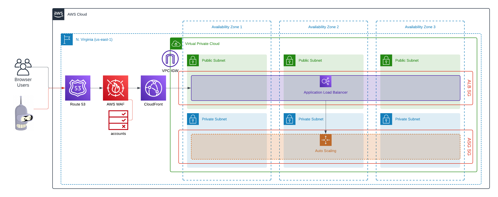

# WAF Challenge Action Demo

## Overview

This Terraform project demonstrates how to use the AWS WAF "Challenge" action without the integration SDK (Interstitial Interaction). The setup includes an ALB, CloudFront distribution, AutoScaling group, and VPC to simulate a basic web application protected by AWS WAF.

## Architecture

The architecture of this demo project is designed to showcase how AWS WAF's "Challenge" action can be implemented without using the integration SDK. The setup involves multiple AWS services working together to simulate a basic web application environment. Below is a breakdown of the architecture components:

### 1. **VPC (Virtual Private Cloud):**

- **Custom VPC:** A Virtual Private Cloud is created to host all the networking components required for the web application.
- **Subnets:** The VPC is divided into public and private subnets across three Availability Zones (AZs).
  - **Public Subnets:** These subnets host the Application Load Balancer (ALB) and provide external access to the web application.
  - **Private Subnets:** These subnets host the AutoScaling group of EC2 instances, which run the web server.

### 2. **ALB (Application Load Balancer):**

- **Load Balancer:** The ALB distributes incoming HTTP traffic across the EC2 instances in the private subnets.
- **Security:** The ALB is configured to only accept traffic from the CloudFront distribution using a security group that allows inbound traffic only from CloudFront's managed prefix list. Additionally, the ALB validates the presence of a custom header (`X-WAF-Header`) added by CloudFront. If the header is missing, the ALB returns an "Access Denied" response.

### 3. **CloudFront Distribution:**

- **Content Delivery Network (CDN):** CloudFront is used as a CDN to serve content globally with low latency.
- **Custom Origin:** The ALB is set as the custom origin for CloudFront, ensuring that all requests to the application go through CloudFront.
- **Custom Headers:** CloudFront adds a custom header (`X-WAF-Header`) to each request before forwarding it to the ALB. This header is validated by the ALB to ensure that traffic is coming from the trusted CloudFront distribution.

### 4. **AutoScaling Group (ASG):**

- **EC2 Instances:** The ASG manages a group of EC2 instances running a simple web server. For this demo environment, the minimum, maximum, and desired capacities are all set to 1, ensuring that only one instance is running at any time.
- **Health Checks:** The ASG is configured with health checks to ensure that only healthy instances receive traffic.

### 5. **WAF (Web Application Firewall):**

- **Challenge Rule:** AWS WAF is configured with a challenge rule that silently verifies if the client is a legitimate browser, without involving the end user. This challenge is run in the background and is useful for filtering out bots while providing a seamless experience for users.
- **Integration with CloudFront:** The WAF is associated with the CloudFront distribution, allowing it to filter and challenge traffic before it reaches the ALB.

### 6. **Route 53:**

- **DNS Management:** Amazon Route 53 is used for DNS management. A subdomain (`waf.example.com`) is created to route traffic to the CloudFront distribution.

This architecture demonstrates a secure and scalable web application environment with AWS services, emphasizing the use of AWS WAF's "Challenge" action to protect sensitive resources and ensure that only legitimate traffic reaches the application.

### Diagram



## Skills

- Terraform
- AWS [VPC, EC2, ALB, CloudFront, WAF]

## Prerequisites

Before running this project, ensure you have the following:

- An active AWS account
- A Route 53 hosted zone with a valid domain name. This project will create the subdomain `waf` for this demo.
  - Example Usage: `domain_name = "michaelgroff.info"`
  - Subdomain Result: `waf.michaelgroff.info`
- Terraform installed on your local machine

## Inputs

The project requires the following inputs:

- **Region:** The AWS region to deploy the infrastructure.
- **Domain Name:** The domain name associated with your Route 53 hosted zone.
- **Zone ID:** The hosted zone ID for your domain.

### Providing Inputs

These inputs can be provided in the `terraform.tfvars` file:

```hcl
# terraform.tfvars
# General
name = "waf-challenge"
region = "us-east-1"
default_tags = {
  "Project" = "waf-challenge"
  "Environment" = "dev"
}

# VPC
azs = ["us-east-1a", "us-east-1b", "us-east-1c"]
cidr = "10.0.0.0/16"
public_subnets = ["10.0.0.0/24", "10.0.2.0/24", "10.0.4.0/24"]
private_subnets = ["10.0.1.0/24", "10.0.3.0/24", "10.0.5.0/24"]
enable_dns_hostnames = true
enable_dns_support = true
enable_nat_gateway = false
single_nat_gateway = false
enable_vpn_gateway = false

# AutoScaling Group
min_size = 1
max_size = 1
desired_capacity = 1
health_check_type = "EC2"
instance_type = "t3.micro"
ebs_optimized = true
enable_monitoring = true

# Domain Information
domain_name = "REPLACE_WITH_DOMAIN_NAME"
zone_id = "REPLACE_WITH_ZONE_ID"
```

### Alternative: CLI Input

Alternatively, you can provide these variables directly in the command line when running `terraform plan` or `terraform apply`:

```bash
terraform plan -var="region=us-east-1" -var="domain_name=example.com" -var="zone_id=ZXXXXXXXXXXXXX"
```

```bash
terraform apply -var="region=us-east-1" -var="domain_name=example.com" -var="zone_id=ZXXXXXXXXXXXXX"
```

This method is useful when you don't want to modify the terraform.tfvars file or when you're running Terraform in an automated environment.

## Usage

1. Clone this repository.

2. Navigate to the project directory.

3. Create a `terraform.tfvars` file with your input values.

4. Initialize Terraform:

   ```bash
   terraform init
   ```

5. Review the Terraform plan:

   ```bash
   terraform plan
   ```

6. Apply the Terraform configuration:

   ```bash
   terraform apply
   ```

## Cleaning Up

To destroy the resources created by this project, run:

```bash
terraform destroy
```

## Requirements

| Name                                                   | Version   |
| ------------------------------------------------------ | --------- |
| <a name="requirement_aws"></a> [aws](#requirement_aws) | ~> 5.62.0 |

## Providers

| Name                                                      | Version |
| --------------------------------------------------------- | ------- |
| <a name="provider_aws"></a> [aws](#provider_aws)          | 5.62.0  |
| <a name="provider_random"></a> [random](#provider_random) | 3.6.2   |

## Modules

| Name                                                              | Source                                | Version  |
| ----------------------------------------------------------------- | ------------------------------------- | -------- |
| <a name="module_acm"></a> [acm](#module_acm)                      | terraform-aws-modules/acm/aws         | ~> 5.1.0 |
| <a name="module_alb"></a> [alb](#module_alb)                      | terraform-aws-modules/alb/aws         | 9.11.0   |
| <a name="module_asg"></a> [asg](#module_asg)                      | terraform-aws-modules/autoscaling/aws | 8.0.0    |
| <a name="module_cloudfront"></a> [cloudfront](#module_cloudfront) | terraform-aws-modules/cloudfront/aws  | 3.4.0    |
| <a name="module_vpc"></a> [vpc](#module_vpc)                      | terraform-aws-modules/vpc/aws         | 5.12.1   |

## Resources

| Name                                                                                                                                             | Type        |
| ------------------------------------------------------------------------------------------------------------------------------------------------ | ----------- |
| [aws_default_security_group.default](https://registry.terraform.io/providers/hashicorp/aws/latest/docs/resources/default_security_group)         | resource    |
| [aws_route53_record.waf](https://registry.terraform.io/providers/hashicorp/aws/latest/docs/resources/route53_record)                             | resource    |
| [aws_wafv2_web_acl.waf](https://registry.terraform.io/providers/hashicorp/aws/latest/docs/resources/wafv2_web_acl)                               | resource    |
| [random_string.custom_header_value](https://registry.terraform.io/providers/hashicorp/random/latest/docs/resources/string)                       | resource    |
| [aws_ami.amazon_linux_2](https://registry.terraform.io/providers/hashicorp/aws/latest/docs/data-sources/ami)                                     | data source |
| [aws_caller_identity.current](https://registry.terraform.io/providers/hashicorp/aws/latest/docs/data-sources/caller_identity)                    | data source |
| [aws_ec2_managed_prefix_list.cloudfront](https://registry.terraform.io/providers/hashicorp/aws/latest/docs/data-sources/ec2_managed_prefix_list) | data source |
| [aws_partition.current](https://registry.terraform.io/providers/hashicorp/aws/latest/docs/data-sources/partition)                                | data source |
| [aws_region.current](https://registry.terraform.io/providers/hashicorp/aws/latest/docs/data-sources/region)                                      | data source |

## Inputs

| Name                                                                                                                                                                                                                                 | Description                                                                                                                                                                                                                                                                                                                                                                                                       | Type                | Default                                                                                                                                                                                                                                                                                                              | Required |
| ------------------------------------------------------------------------------------------------------------------------------------------------------------------------------------------------------------------------------------ | ----------------------------------------------------------------------------------------------------------------------------------------------------------------------------------------------------------------------------------------------------------------------------------------------------------------------------------------------------------------------------------------------------------------- | ------------------- | -------------------------------------------------------------------------------------------------------------------------------------------------------------------------------------------------------------------------------------------------------------------------------------------------------------------- | :------: |
| <a name="input_acm_certificate_domain_validation_options"></a> [acm_certificate_domain_validation_options](#input_acm_certificate_domain_validation_options)                                                                         | A list of domain_validation_options created by the ACM certificate to create required Route53 records from it (used when create_route53_records_only is set to true)                                                                                                                                                                                                                                              | `any`               | `{}`                                                                                                                                                                                                                                                                                                                 |    no    |
| <a name="input_amazon_side_asn"></a> [amazon_side_asn](#input_amazon_side_asn)                                                                                                                                                       | The Autonomous System Number (ASN) for the Amazon side of the gateway. By default the virtual private gateway is created with the current default Amazon ASN                                                                                                                                                                                                                                                      | `string`            | `"64512"`                                                                                                                                                                                                                                                                                                            |    no    |
| <a name="input_autoscaling_group_tags"></a> [autoscaling_group_tags](#input_autoscaling_group_tags)                                                                                                                                  | A map of additional tags to add to the autoscaling group                                                                                                                                                                                                                                                                                                                                                          | `map(string)`       | `{}`                                                                                                                                                                                                                                                                                                                 |    no    |
| <a name="input_availability_zones"></a> [availability_zones](#input_availability_zones)                                                                                                                                              | A list of one or more availability zones for the group. Used for EC2-Classic and default subnets when not specified with `vpc_zone_identifier` argument. Conflicts with `vpc_zone_identifier`                                                                                                                                                                                                                     | `list(string)`      | `null`                                                                                                                                                                                                                                                                                                               |    no    |
| <a name="input_azs"></a> [azs](#input_azs)                                                                                                                                                                                           | A list of availability zones names or ids in the region                                                                                                                                                                                                                                                                                                                                                           | `list(string)`      | `[]`                                                                                                                                                                                                                                                                                                                 |    no    |
| <a name="input_block_device_mappings"></a> [block_device_mappings](#input_block_device_mappings)                                                                                                                                     | Specify volumes to attach to the instance besides the volumes specified by the AMI                                                                                                                                                                                                                                                                                                                                | `list(any)`         | `[]`                                                                                                                                                                                                                                                                                                                 |    no    |
| <a name="input_capacity_rebalance"></a> [capacity_rebalance](#input_capacity_rebalance)                                                                                                                                              | Indicates whether capacity rebalance is enabled                                                                                                                                                                                                                                                                                                                                                                   | `bool`              | `null`                                                                                                                                                                                                                                                                                                               |    no    |
| <a name="input_capacity_reservation_specification"></a> [capacity_reservation_specification](#input_capacity_reservation_specification)                                                                                              | Targeting for EC2 capacity reservations                                                                                                                                                                                                                                                                                                                                                                           | `any`               | `{}`                                                                                                                                                                                                                                                                                                                 |    no    |
| <a name="input_certificate_transparency_logging_preference"></a> [certificate_transparency_logging_preference](#input_certificate_transparency_logging_preference)                                                                   | Specifies whether certificate details should be added to a certificate transparency log                                                                                                                                                                                                                                                                                                                           | `bool`              | `true`                                                                                                                                                                                                                                                                                                               |    no    |
| <a name="input_cidr"></a> [cidr](#input_cidr)                                                                                                                                                                                        | (Optional) The IPv4 CIDR block for the VPC. CIDR can be explicitly set or it can be derived from IPAM using `ipv4_netmask_length` & `ipv4_ipam_pool_id`                                                                                                                                                                                                                                                           | `string`            | `"10.0.0.0/16"`                                                                                                                                                                                                                                                                                                      |    no    |
| <a name="input_cpu_options"></a> [cpu_options](#input_cpu_options)                                                                                                                                                                   | The CPU options for the instance                                                                                                                                                                                                                                                                                                                                                                                  | `map(string)`       | `{}`                                                                                                                                                                                                                                                                                                                 |    no    |
| <a name="input_create"></a> [create](#input_create)                                                                                                                                                                                  | Determines whether to create autoscaling group or not                                                                                                                                                                                                                                                                                                                                                             | `bool`              | `true`                                                                                                                                                                                                                                                                                                               |    no    |
| <a name="input_create_certificate"></a> [create_certificate](#input_create_certificate)                                                                                                                                              | Whether to create ACM certificate                                                                                                                                                                                                                                                                                                                                                                                 | `bool`              | `true`                                                                                                                                                                                                                                                                                                               |    no    |
| <a name="input_create_database_internet_gateway_route"></a> [create_database_internet_gateway_route](#input_create_database_internet_gateway_route)                                                                                  | Controls if an internet gateway route for public database access should be created                                                                                                                                                                                                                                                                                                                                | `bool`              | `false`                                                                                                                                                                                                                                                                                                              |    no    |
| <a name="input_create_database_nat_gateway_route"></a> [create_database_nat_gateway_route](#input_create_database_nat_gateway_route)                                                                                                 | Controls if a nat gateway route should be created to give internet access to the database subnets                                                                                                                                                                                                                                                                                                                 | `bool`              | `false`                                                                                                                                                                                                                                                                                                              |    no    |
| <a name="input_create_database_subnet_group"></a> [create_database_subnet_group](#input_create_database_subnet_group)                                                                                                                | Controls if database subnet group should be created (n.b. database_subnets must also be set)                                                                                                                                                                                                                                                                                                                      | `bool`              | `true`                                                                                                                                                                                                                                                                                                               |    no    |
| <a name="input_create_database_subnet_route_table"></a> [create_database_subnet_route_table](#input_create_database_subnet_route_table)                                                                                              | Controls if separate route table for database should be created                                                                                                                                                                                                                                                                                                                                                   | `bool`              | `false`                                                                                                                                                                                                                                                                                                              |    no    |
| <a name="input_create_egress_only_igw"></a> [create_egress_only_igw](#input_create_egress_only_igw)                                                                                                                                  | Controls if an Egress Only Internet Gateway is created and its related routes                                                                                                                                                                                                                                                                                                                                     | `bool`              | `true`                                                                                                                                                                                                                                                                                                               |    no    |
| <a name="input_create_elasticache_subnet_group"></a> [create_elasticache_subnet_group](#input_create_elasticache_subnet_group)                                                                                                       | Controls if elasticache subnet group should be created                                                                                                                                                                                                                                                                                                                                                            | `bool`              | `true`                                                                                                                                                                                                                                                                                                               |    no    |
| <a name="input_create_elasticache_subnet_route_table"></a> [create_elasticache_subnet_route_table](#input_create_elasticache_subnet_route_table)                                                                                     | Controls if separate route table for elasticache should be created                                                                                                                                                                                                                                                                                                                                                | `bool`              | `false`                                                                                                                                                                                                                                                                                                              |    no    |
| <a name="input_create_flow_log_cloudwatch_iam_role"></a> [create_flow_log_cloudwatch_iam_role](#input_create_flow_log_cloudwatch_iam_role)                                                                                           | Whether to create IAM role for VPC Flow Logs                                                                                                                                                                                                                                                                                                                                                                      | `bool`              | `false`                                                                                                                                                                                                                                                                                                              |    no    |
| <a name="input_create_flow_log_cloudwatch_log_group"></a> [create_flow_log_cloudwatch_log_group](#input_create_flow_log_cloudwatch_log_group)                                                                                        | Whether to create CloudWatch log group for VPC Flow Logs                                                                                                                                                                                                                                                                                                                                                          | `bool`              | `false`                                                                                                                                                                                                                                                                                                              |    no    |
| <a name="input_create_iam_instance_profile"></a> [create_iam_instance_profile](#input_create_iam_instance_profile)                                                                                                                   | Determines whether an IAM instance profile is created or to use an existing IAM instance profile                                                                                                                                                                                                                                                                                                                  | `bool`              | `false`                                                                                                                                                                                                                                                                                                              |    no    |
| <a name="input_create_igw"></a> [create_igw](#input_create_igw)                                                                                                                                                                      | Controls if an Internet Gateway is created for public subnets and the related routes that connect them                                                                                                                                                                                                                                                                                                            | `bool`              | `true`                                                                                                                                                                                                                                                                                                               |    no    |
| <a name="input_create_launch_template"></a> [create_launch_template](#input_create_launch_template)                                                                                                                                  | Determines whether to create launch template or not                                                                                                                                                                                                                                                                                                                                                               | `bool`              | `true`                                                                                                                                                                                                                                                                                                               |    no    |
| <a name="input_create_multiple_intra_route_tables"></a> [create_multiple_intra_route_tables](#input_create_multiple_intra_route_tables)                                                                                              | Indicates whether to create a separate route table for each intra subnet. Default: `false`                                                                                                                                                                                                                                                                                                                        | `bool`              | `false`                                                                                                                                                                                                                                                                                                              |    no    |
| <a name="input_create_multiple_public_route_tables"></a> [create_multiple_public_route_tables](#input_create_multiple_public_route_tables)                                                                                           | Indicates whether to create a separate route table for each public subnet. Default: `false`                                                                                                                                                                                                                                                                                                                       | `bool`              | `false`                                                                                                                                                                                                                                                                                                              |    no    |
| <a name="input_create_redshift_subnet_group"></a> [create_redshift_subnet_group](#input_create_redshift_subnet_group)                                                                                                                | Controls if redshift subnet group should be created                                                                                                                                                                                                                                                                                                                                                               | `bool`              | `true`                                                                                                                                                                                                                                                                                                               |    no    |
| <a name="input_create_redshift_subnet_route_table"></a> [create_redshift_subnet_route_table](#input_create_redshift_subnet_route_table)                                                                                              | Controls if separate route table for redshift should be created                                                                                                                                                                                                                                                                                                                                                   | `bool`              | `false`                                                                                                                                                                                                                                                                                                              |    no    |
| <a name="input_create_route53_records"></a> [create_route53_records](#input_create_route53_records)                                                                                                                                  | When validation is set to DNS, define whether to create the DNS records internally via Route53 or externally using any DNS provider                                                                                                                                                                                                                                                                               | `bool`              | `true`                                                                                                                                                                                                                                                                                                               |    no    |
| <a name="input_create_route53_records_only"></a> [create_route53_records_only](#input_create_route53_records_only)                                                                                                                   | Whether to create only Route53 records (e.g. using separate AWS provider)                                                                                                                                                                                                                                                                                                                                         | `bool`              | `false`                                                                                                                                                                                                                                                                                                              |    no    |
| <a name="input_create_scaling_policy"></a> [create_scaling_policy](#input_create_scaling_policy)                                                                                                                                     | Determines whether to create target scaling policy schedule or not                                                                                                                                                                                                                                                                                                                                                | `bool`              | `true`                                                                                                                                                                                                                                                                                                               |    no    |
| <a name="input_create_schedule"></a> [create_schedule](#input_create_schedule)                                                                                                                                                       | Determines whether to create autoscaling group schedule or not                                                                                                                                                                                                                                                                                                                                                    | `bool`              | `true`                                                                                                                                                                                                                                                                                                               |    no    |
| <a name="input_create_traffic_source_attachment"></a> [create_traffic_source_attachment](#input_create_traffic_source_attachment)                                                                                                    | Determines whether to create autoscaling group traffic source attachment                                                                                                                                                                                                                                                                                                                                          | `bool`              | `false`                                                                                                                                                                                                                                                                                                              |    no    |
| <a name="input_create_vpc"></a> [create_vpc](#input_create_vpc)                                                                                                                                                                      | Controls if VPC should be created (it affects almost all resources)                                                                                                                                                                                                                                                                                                                                               | `bool`              | `true`                                                                                                                                                                                                                                                                                                               |    no    |
| <a name="input_credit_specification"></a> [credit_specification](#input_credit_specification)                                                                                                                                        | Customize the credit specification of the instance                                                                                                                                                                                                                                                                                                                                                                | `map(string)`       | `{}`                                                                                                                                                                                                                                                                                                                 |    no    |
| <a name="input_customer_gateway_tags"></a> [customer_gateway_tags](#input_customer_gateway_tags)                                                                                                                                     | Additional tags for the Customer Gateway                                                                                                                                                                                                                                                                                                                                                                          | `map(string)`       | `{}`                                                                                                                                                                                                                                                                                                                 |    no    |
| <a name="input_customer_gateways"></a> [customer_gateways](#input_customer_gateways)                                                                                                                                                 | Maps of Customer Gateway's attributes (BGP ASN and Gateway's Internet-routable external IP address)                                                                                                                                                                                                                                                                                                               | `map(map(any))`     | `{}`                                                                                                                                                                                                                                                                                                                 |    no    |
| <a name="input_customer_owned_ipv4_pool"></a> [customer_owned_ipv4_pool](#input_customer_owned_ipv4_pool)                                                                                                                            | The customer owned IPv4 address pool. Typically used with the `map_customer_owned_ip_on_launch` argument. The `outpost_arn` argument must be specified when configured                                                                                                                                                                                                                                            | `string`            | `null`                                                                                                                                                                                                                                                                                                               |    no    |
| <a name="input_database_acl_tags"></a> [database_acl_tags](#input_database_acl_tags)                                                                                                                                                 | Additional tags for the database subnets network ACL                                                                                                                                                                                                                                                                                                                                                              | `map(string)`       | `{}`                                                                                                                                                                                                                                                                                                                 |    no    |
| <a name="input_database_dedicated_network_acl"></a> [database_dedicated_network_acl](#input_database_dedicated_network_acl)                                                                                                          | Whether to use dedicated network ACL (not default) and custom rules for database subnets                                                                                                                                                                                                                                                                                                                          | `bool`              | `false`                                                                                                                                                                                                                                                                                                              |    no    |
| <a name="input_database_inbound_acl_rules"></a> [database_inbound_acl_rules](#input_database_inbound_acl_rules)                                                                                                                      | Database subnets inbound network ACL rules                                                                                                                                                                                                                                                                                                                                                                        | `list(map(string))` | <pre>[<br> {<br> "cidr_block": "0.0.0.0/0",<br> "from_port": 0,<br> "protocol": "-1",<br> "rule_action": "allow",<br> "rule_number": 100,<br> "to_port": 0<br> }<br>]</pre>                                                                                                                                          |    no    |
| <a name="input_database_outbound_acl_rules"></a> [database_outbound_acl_rules](#input_database_outbound_acl_rules)                                                                                                                   | Database subnets outbound network ACL rules                                                                                                                                                                                                                                                                                                                                                                       | `list(map(string))` | <pre>[<br> {<br> "cidr_block": "0.0.0.0/0",<br> "from_port": 0,<br> "protocol": "-1",<br> "rule_action": "allow",<br> "rule_number": 100,<br> "to_port": 0<br> }<br>]</pre>                                                                                                                                          |    no    |
| <a name="input_database_route_table_tags"></a> [database_route_table_tags](#input_database_route_table_tags)                                                                                                                         | Additional tags for the database route tables                                                                                                                                                                                                                                                                                                                                                                     | `map(string)`       | `{}`                                                                                                                                                                                                                                                                                                                 |    no    |
| <a name="input_database_subnet_assign_ipv6_address_on_creation"></a> [database_subnet_assign_ipv6_address_on_creation](#input_database_subnet_assign_ipv6_address_on_creation)                                                       | Specify true to indicate that network interfaces created in the specified subnet should be assigned an IPv6 address. Default is `false`                                                                                                                                                                                                                                                                           | `bool`              | `false`                                                                                                                                                                                                                                                                                                              |    no    |
| <a name="input_database_subnet_enable_dns64"></a> [database_subnet_enable_dns64](#input_database_subnet_enable_dns64)                                                                                                                | Indicates whether DNS queries made to the Amazon-provided DNS Resolver in this subnet should return synthetic IPv6 addresses for IPv4-only destinations. Default: `true`                                                                                                                                                                                                                                          | `bool`              | `true`                                                                                                                                                                                                                                                                                                               |    no    |
| <a name="input_database_subnet_enable_resource_name_dns_a_record_on_launch"></a> [database_subnet_enable_resource_name_dns_a_record_on_launch](#input_database_subnet_enable_resource_name_dns_a_record_on_launch)                   | Indicates whether to respond to DNS queries for instance hostnames with DNS A records. Default: `false`                                                                                                                                                                                                                                                                                                           | `bool`              | `false`                                                                                                                                                                                                                                                                                                              |    no    |
| <a name="input_database_subnet_enable_resource_name_dns_aaaa_record_on_launch"></a> [database_subnet_enable_resource_name_dns_aaaa_record_on_launch](#input_database_subnet_enable_resource_name_dns_aaaa_record_on_launch)          | Indicates whether to respond to DNS queries for instance hostnames with DNS AAAA records. Default: `true`                                                                                                                                                                                                                                                                                                         | `bool`              | `true`                                                                                                                                                                                                                                                                                                               |    no    |
| <a name="input_database_subnet_group_name"></a> [database_subnet_group_name](#input_database_subnet_group_name)                                                                                                                      | Name of database subnet group                                                                                                                                                                                                                                                                                                                                                                                     | `string`            | `null`                                                                                                                                                                                                                                                                                                               |    no    |
| <a name="input_database_subnet_group_tags"></a> [database_subnet_group_tags](#input_database_subnet_group_tags)                                                                                                                      | Additional tags for the database subnet group                                                                                                                                                                                                                                                                                                                                                                     | `map(string)`       | `{}`                                                                                                                                                                                                                                                                                                                 |    no    |
| <a name="input_database_subnet_ipv6_native"></a> [database_subnet_ipv6_native](#input_database_subnet_ipv6_native)                                                                                                                   | Indicates whether to create an IPv6-only subnet. Default: `false`                                                                                                                                                                                                                                                                                                                                                 | `bool`              | `false`                                                                                                                                                                                                                                                                                                              |    no    |
| <a name="input_database_subnet_ipv6_prefixes"></a> [database_subnet_ipv6_prefixes](#input_database_subnet_ipv6_prefixes)                                                                                                             | Assigns IPv6 database subnet id based on the Amazon provided /56 prefix base 10 integer (0-256). Must be of equal length to the corresponding IPv4 subnet list                                                                                                                                                                                                                                                    | `list(string)`      | `[]`                                                                                                                                                                                                                                                                                                                 |    no    |
| <a name="input_database_subnet_names"></a> [database_subnet_names](#input_database_subnet_names)                                                                                                                                     | Explicit values to use in the Name tag on database subnets. If empty, Name tags are generated                                                                                                                                                                                                                                                                                                                     | `list(string)`      | `[]`                                                                                                                                                                                                                                                                                                                 |    no    |
| <a name="input_database_subnet_private_dns_hostname_type_on_launch"></a> [database_subnet_private_dns_hostname_type_on_launch](#input_database_subnet_private_dns_hostname_type_on_launch)                                           | The type of hostnames to assign to instances in the subnet at launch. For IPv6-only subnets, an instance DNS name must be based on the instance ID. For dual-stack and IPv4-only subnets, you can specify whether DNS names use the instance IPv4 address or the instance ID. Valid values: `ip-name`, `resource-name`                                                                                            | `string`            | `null`                                                                                                                                                                                                                                                                                                               |    no    |
| <a name="input_database_subnet_suffix"></a> [database_subnet_suffix](#input_database_subnet_suffix)                                                                                                                                  | Suffix to append to database subnets name                                                                                                                                                                                                                                                                                                                                                                         | `string`            | `"db"`                                                                                                                                                                                                                                                                                                               |    no    |
| <a name="input_database_subnet_tags"></a> [database_subnet_tags](#input_database_subnet_tags)                                                                                                                                        | Additional tags for the database subnets                                                                                                                                                                                                                                                                                                                                                                          | `map(string)`       | `{}`                                                                                                                                                                                                                                                                                                                 |    no    |
| <a name="input_database_subnets"></a> [database_subnets](#input_database_subnets)                                                                                                                                                    | A list of database subnets inside the VPC                                                                                                                                                                                                                                                                                                                                                                         | `list(string)`      | `[]`                                                                                                                                                                                                                                                                                                                 |    no    |
| <a name="input_default_cooldown"></a> [default_cooldown](#input_default_cooldown)                                                                                                                                                    | The amount of time, in seconds, after a scaling activity completes before another scaling activity can start                                                                                                                                                                                                                                                                                                      | `number`            | `null`                                                                                                                                                                                                                                                                                                               |    no    |
| <a name="input_default_instance_warmup"></a> [default_instance_warmup](#input_default_instance_warmup)                                                                                                                               | Amount of time, in seconds, until a newly launched instance can contribute to the Amazon CloudWatch metrics. This delay lets an instance finish initializing before Amazon EC2 Auto Scaling aggregates instance metrics, resulting in more reliable usage data. Set this value equal to the amount of time that it takes for resource consumption to become stable after an instance reaches the InService state. | `number`            | `null`                                                                                                                                                                                                                                                                                                               |    no    |
| <a name="input_default_network_acl_egress"></a> [default_network_acl_egress](#input_default_network_acl_egress)                                                                                                                      | List of maps of egress rules to set on the Default Network ACL                                                                                                                                                                                                                                                                                                                                                    | `list(map(string))` | <pre>[<br> {<br> "action": "allow",<br> "cidr_block": "0.0.0.0/0",<br> "from_port": 0,<br> "protocol": "-1",<br> "rule_no": 100,<br> "to_port": 0<br> },<br> {<br> "action": "allow",<br> "from_port": 0,<br> "ipv6_cidr_block": "::/0",<br> "protocol": "-1",<br> "rule_no": 101,<br> "to_port": 0<br> }<br>]</pre> |    no    |
| <a name="input_default_network_acl_ingress"></a> [default_network_acl_ingress](#input_default_network_acl_ingress)                                                                                                                   | List of maps of ingress rules to set on the Default Network ACL                                                                                                                                                                                                                                                                                                                                                   | `list(map(string))` | <pre>[<br> {<br> "action": "allow",<br> "cidr_block": "0.0.0.0/0",<br> "from_port": 0,<br> "protocol": "-1",<br> "rule_no": 100,<br> "to_port": 0<br> },<br> {<br> "action": "allow",<br> "from_port": 0,<br> "ipv6_cidr_block": "::/0",<br> "protocol": "-1",<br> "rule_no": 101,<br> "to_port": 0<br> }<br>]</pre> |    no    |
| <a name="input_default_network_acl_name"></a> [default_network_acl_name](#input_default_network_acl_name)                                                                                                                            | Name to be used on the Default Network ACL                                                                                                                                                                                                                                                                                                                                                                        | `string`            | `null`                                                                                                                                                                                                                                                                                                               |    no    |
| <a name="input_default_network_acl_tags"></a> [default_network_acl_tags](#input_default_network_acl_tags)                                                                                                                            | Additional tags for the Default Network ACL                                                                                                                                                                                                                                                                                                                                                                       | `map(string)`       | `{}`                                                                                                                                                                                                                                                                                                                 |    no    |
| <a name="input_default_route_table_name"></a> [default_route_table_name](#input_default_route_table_name)                                                                                                                            | Name to be used on the default route table                                                                                                                                                                                                                                                                                                                                                                        | `string`            | `null`                                                                                                                                                                                                                                                                                                               |    no    |
| <a name="input_default_route_table_propagating_vgws"></a> [default_route_table_propagating_vgws](#input_default_route_table_propagating_vgws)                                                                                        | List of virtual gateways for propagation                                                                                                                                                                                                                                                                                                                                                                          | `list(string)`      | `[]`                                                                                                                                                                                                                                                                                                                 |    no    |
| <a name="input_default_route_table_routes"></a> [default_route_table_routes](#input_default_route_table_routes)                                                                                                                      | Configuration block of routes. See https://registry.terraform.io/providers/hashicorp/aws/latest/docs/resources/default_route_table#route                                                                                                                                                                                                                                                                          | `list(map(string))` | `[]`                                                                                                                                                                                                                                                                                                                 |    no    |
| <a name="input_default_route_table_tags"></a> [default_route_table_tags](#input_default_route_table_tags)                                                                                                                            | Additional tags for the default route table                                                                                                                                                                                                                                                                                                                                                                       | `map(string)`       | `{}`                                                                                                                                                                                                                                                                                                                 |    no    |
| <a name="input_default_security_group_egress"></a> [default_security_group_egress](#input_default_security_group_egress)                                                                                                             | List of maps of egress rules to set on the default security group                                                                                                                                                                                                                                                                                                                                                 | `list(map(string))` | `[]`                                                                                                                                                                                                                                                                                                                 |    no    |
| <a name="input_default_security_group_ingress"></a> [default_security_group_ingress](#input_default_security_group_ingress)                                                                                                          | List of maps of ingress rules to set on the default security group                                                                                                                                                                                                                                                                                                                                                | `list(map(string))` | `[]`                                                                                                                                                                                                                                                                                                                 |    no    |
| <a name="input_default_security_group_name"></a> [default_security_group_name](#input_default_security_group_name)                                                                                                                   | Name to be used on the default security group                                                                                                                                                                                                                                                                                                                                                                     | `string`            | `null`                                                                                                                                                                                                                                                                                                               |    no    |
| <a name="input_default_security_group_tags"></a> [default_security_group_tags](#input_default_security_group_tags)                                                                                                                   | Additional tags for the default security group                                                                                                                                                                                                                                                                                                                                                                    | `map(string)`       | `{}`                                                                                                                                                                                                                                                                                                                 |    no    |
| <a name="input_default_tags"></a> [default_tags](#input_default_tags)                                                                                                                                                                | Default tags to apply to all resources                                                                                                                                                                                                                                                                                                                                                                            | `map(string)`       | n/a                                                                                                                                                                                                                                                                                                                  |   yes    |
| <a name="input_default_version"></a> [default_version](#input_default_version)                                                                                                                                                       | Default Version of the launch template                                                                                                                                                                                                                                                                                                                                                                            | `string`            | `null`                                                                                                                                                                                                                                                                                                               |    no    |
| <a name="input_default_vpc_enable_dns_hostnames"></a> [default_vpc_enable_dns_hostnames](#input_default_vpc_enable_dns_hostnames)                                                                                                    | Should be true to enable DNS hostnames in the Default VPC                                                                                                                                                                                                                                                                                                                                                         | `bool`              | `true`                                                                                                                                                                                                                                                                                                               |    no    |
| <a name="input_default_vpc_enable_dns_support"></a> [default_vpc_enable_dns_support](#input_default_vpc_enable_dns_support)                                                                                                          | Should be true to enable DNS support in the Default VPC                                                                                                                                                                                                                                                                                                                                                           | `bool`              | `true`                                                                                                                                                                                                                                                                                                               |    no    |
| <a name="input_default_vpc_name"></a> [default_vpc_name](#input_default_vpc_name)                                                                                                                                                    | Name to be used on the Default VPC                                                                                                                                                                                                                                                                                                                                                                                | `string`            | `null`                                                                                                                                                                                                                                                                                                               |    no    |
| <a name="input_default_vpc_tags"></a> [default_vpc_tags](#input_default_vpc_tags)                                                                                                                                                    | Additional tags for the Default VPC                                                                                                                                                                                                                                                                                                                                                                               | `map(string)`       | `{}`                                                                                                                                                                                                                                                                                                                 |    no    |
| <a name="input_delete_timeout"></a> [delete_timeout](#input_delete_timeout)                                                                                                                                                          | Delete timeout to wait for destroying autoscaling group                                                                                                                                                                                                                                                                                                                                                           | `string`            | `null`                                                                                                                                                                                                                                                                                                               |    no    |
| <a name="input_desired_capacity"></a> [desired_capacity](#input_desired_capacity)                                                                                                                                                    | The number of Amazon EC2 instances that should be running in the autoscaling group                                                                                                                                                                                                                                                                                                                                | `number`            | `null`                                                                                                                                                                                                                                                                                                               |    no    |
| <a name="input_desired_capacity_type"></a> [desired_capacity_type](#input_desired_capacity_type)                                                                                                                                     | The unit of measurement for the value specified for desired_capacity. Supported for attribute-based instance type selection only. Valid values: `units`, `vcpu`, `memory-mib`.                                                                                                                                                                                                                                    | `string`            | `null`                                                                                                                                                                                                                                                                                                               |    no    |
| <a name="input_dhcp_options_domain_name"></a> [dhcp_options_domain_name](#input_dhcp_options_domain_name)                                                                                                                            | Specifies DNS name for DHCP options set (requires enable_dhcp_options set to true)                                                                                                                                                                                                                                                                                                                                | `string`            | `""`                                                                                                                                                                                                                                                                                                                 |    no    |
| <a name="input_dhcp_options_domain_name_servers"></a> [dhcp_options_domain_name_servers](#input_dhcp_options_domain_name_servers)                                                                                                    | Specify a list of DNS server addresses for DHCP options set, default to AWS provided (requires enable_dhcp_options set to true)                                                                                                                                                                                                                                                                                   | `list(string)`      | <pre>[<br> "AmazonProvidedDNS"<br>]</pre>                                                                                                                                                                                                                                                                            |    no    |
| <a name="input_dhcp_options_ipv6_address_preferred_lease_time"></a> [dhcp_options_ipv6_address_preferred_lease_time](#input_dhcp_options_ipv6_address_preferred_lease_time)                                                          | How frequently, in seconds, a running instance with an IPv6 assigned to it goes through DHCPv6 lease renewal (requires enable_dhcp_options set to true)                                                                                                                                                                                                                                                           | `number`            | `null`                                                                                                                                                                                                                                                                                                               |    no    |
| <a name="input_dhcp_options_netbios_name_servers"></a> [dhcp_options_netbios_name_servers](#input_dhcp_options_netbios_name_servers)                                                                                                 | Specify a list of netbios servers for DHCP options set (requires enable_dhcp_options set to true)                                                                                                                                                                                                                                                                                                                 | `list(string)`      | `[]`                                                                                                                                                                                                                                                                                                                 |    no    |
| <a name="input_dhcp_options_netbios_node_type"></a> [dhcp_options_netbios_node_type](#input_dhcp_options_netbios_node_type)                                                                                                          | Specify netbios node_type for DHCP options set (requires enable_dhcp_options set to true)                                                                                                                                                                                                                                                                                                                         | `string`            | `""`                                                                                                                                                                                                                                                                                                                 |    no    |
| <a name="input_dhcp_options_ntp_servers"></a> [dhcp_options_ntp_servers](#input_dhcp_options_ntp_servers)                                                                                                                            | Specify a list of NTP servers for DHCP options set (requires enable_dhcp_options set to true)                                                                                                                                                                                                                                                                                                                     | `list(string)`      | `[]`                                                                                                                                                                                                                                                                                                                 |    no    |
| <a name="input_dhcp_options_tags"></a> [dhcp_options_tags](#input_dhcp_options_tags)                                                                                                                                                 | Additional tags for the DHCP option set (requires enable_dhcp_options set to true)                                                                                                                                                                                                                                                                                                                                | `map(string)`       | `{}`                                                                                                                                                                                                                                                                                                                 |    no    |
| <a name="input_disable_api_stop"></a> [disable_api_stop](#input_disable_api_stop)                                                                                                                                                    | If true, enables EC2 instance stop protection                                                                                                                                                                                                                                                                                                                                                                     | `bool`              | `null`                                                                                                                                                                                                                                                                                                               |    no    |
| <a name="input_disable_api_termination"></a> [disable_api_termination](#input_disable_api_termination)                                                                                                                               | If true, enables EC2 instance termination protection                                                                                                                                                                                                                                                                                                                                                              | `bool`              | `null`                                                                                                                                                                                                                                                                                                               |    no    |
| <a name="input_distinct_domain_names"></a> [distinct_domain_names](#input_distinct_domain_names)                                                                                                                                     | List of distinct domains and SANs (used when create_route53_records_only is set to true)                                                                                                                                                                                                                                                                                                                          | `list(string)`      | `[]`                                                                                                                                                                                                                                                                                                                 |    no    |
| <a name="input_dns_ttl"></a> [dns_ttl](#input_dns_ttl)                                                                                                                                                                               | The TTL of DNS recursive resolvers to cache information about this record.                                                                                                                                                                                                                                                                                                                                        | `number`            | `60`                                                                                                                                                                                                                                                                                                                 |    no    |
| <a name="input_domain_name"></a> [domain_name](#input_domain_name)                                                                                                                                                                   | A domain name for which the certificate should be issued                                                                                                                                                                                                                                                                                                                                                          | `string`            | `""`                                                                                                                                                                                                                                                                                                                 |    no    |
| <a name="input_ebs_optimized"></a> [ebs_optimized](#input_ebs_optimized)                                                                                                                                                             | If true, the launched EC2 instance will be EBS-optimized                                                                                                                                                                                                                                                                                                                                                          | `bool`              | `null`                                                                                                                                                                                                                                                                                                               |    no    |
| <a name="input_elastic_gpu_specifications"></a> [elastic_gpu_specifications](#input_elastic_gpu_specifications)                                                                                                                      | The elastic GPU to attach to the instance                                                                                                                                                                                                                                                                                                                                                                         | `map(string)`       | `{}`                                                                                                                                                                                                                                                                                                                 |    no    |
| <a name="input_elastic_inference_accelerator"></a> [elastic_inference_accelerator](#input_elastic_inference_accelerator)                                                                                                             | Configuration block containing an Elastic Inference Accelerator to attach to the instance                                                                                                                                                                                                                                                                                                                         | `map(string)`       | `{}`                                                                                                                                                                                                                                                                                                                 |    no    |
| <a name="input_elasticache_acl_tags"></a> [elasticache_acl_tags](#input_elasticache_acl_tags)                                                                                                                                        | Additional tags for the elasticache subnets network ACL                                                                                                                                                                                                                                                                                                                                                           | `map(string)`       | `{}`                                                                                                                                                                                                                                                                                                                 |    no    |
| <a name="input_elasticache_dedicated_network_acl"></a> [elasticache_dedicated_network_acl](#input_elasticache_dedicated_network_acl)                                                                                                 | Whether to use dedicated network ACL (not default) and custom rules for elasticache subnets                                                                                                                                                                                                                                                                                                                       | `bool`              | `false`                                                                                                                                                                                                                                                                                                              |    no    |
| <a name="input_elasticache_inbound_acl_rules"></a> [elasticache_inbound_acl_rules](#input_elasticache_inbound_acl_rules)                                                                                                             | Elasticache subnets inbound network ACL rules                                                                                                                                                                                                                                                                                                                                                                     | `list(map(string))` | <pre>[<br> {<br> "cidr_block": "0.0.0.0/0",<br> "from_port": 0,<br> "protocol": "-1",<br> "rule_action": "allow",<br> "rule_number": 100,<br> "to_port": 0<br> }<br>]</pre>                                                                                                                                          |    no    |
| <a name="input_elasticache_outbound_acl_rules"></a> [elasticache_outbound_acl_rules](#input_elasticache_outbound_acl_rules)                                                                                                          | Elasticache subnets outbound network ACL rules                                                                                                                                                                                                                                                                                                                                                                    | `list(map(string))` | <pre>[<br> {<br> "cidr_block": "0.0.0.0/0",<br> "from_port": 0,<br> "protocol": "-1",<br> "rule_action": "allow",<br> "rule_number": 100,<br> "to_port": 0<br> }<br>]</pre>                                                                                                                                          |    no    |
| <a name="input_elasticache_route_table_tags"></a> [elasticache_route_table_tags](#input_elasticache_route_table_tags)                                                                                                                | Additional tags for the elasticache route tables                                                                                                                                                                                                                                                                                                                                                                  | `map(string)`       | `{}`                                                                                                                                                                                                                                                                                                                 |    no    |
| <a name="input_elasticache_subnet_assign_ipv6_address_on_creation"></a> [elasticache_subnet_assign_ipv6_address_on_creation](#input_elasticache_subnet_assign_ipv6_address_on_creation)                                              | Specify true to indicate that network interfaces created in the specified subnet should be assigned an IPv6 address. Default is `false`                                                                                                                                                                                                                                                                           | `bool`              | `false`                                                                                                                                                                                                                                                                                                              |    no    |
| <a name="input_elasticache_subnet_enable_dns64"></a> [elasticache_subnet_enable_dns64](#input_elasticache_subnet_enable_dns64)                                                                                                       | Indicates whether DNS queries made to the Amazon-provided DNS Resolver in this subnet should return synthetic IPv6 addresses for IPv4-only destinations. Default: `true`                                                                                                                                                                                                                                          | `bool`              | `true`                                                                                                                                                                                                                                                                                                               |    no    |
| <a name="input_elasticache_subnet_enable_resource_name_dns_a_record_on_launch"></a> [elasticache_subnet_enable_resource_name_dns_a_record_on_launch](#input_elasticache_subnet_enable_resource_name_dns_a_record_on_launch)          | Indicates whether to respond to DNS queries for instance hostnames with DNS A records. Default: `false`                                                                                                                                                                                                                                                                                                           | `bool`              | `false`                                                                                                                                                                                                                                                                                                              |    no    |
| <a name="input_elasticache_subnet_enable_resource_name_dns_aaaa_record_on_launch"></a> [elasticache_subnet_enable_resource_name_dns_aaaa_record_on_launch](#input_elasticache_subnet_enable_resource_name_dns_aaaa_record_on_launch) | Indicates whether to respond to DNS queries for instance hostnames with DNS AAAA records. Default: `true`                                                                                                                                                                                                                                                                                                         | `bool`              | `true`                                                                                                                                                                                                                                                                                                               |    no    |
| <a name="input_elasticache_subnet_group_name"></a> [elasticache_subnet_group_name](#input_elasticache_subnet_group_name)                                                                                                             | Name of elasticache subnet group                                                                                                                                                                                                                                                                                                                                                                                  | `string`            | `null`                                                                                                                                                                                                                                                                                                               |    no    |
| <a name="input_elasticache_subnet_group_tags"></a> [elasticache_subnet_group_tags](#input_elasticache_subnet_group_tags)                                                                                                             | Additional tags for the elasticache subnet group                                                                                                                                                                                                                                                                                                                                                                  | `map(string)`       | `{}`                                                                                                                                                                                                                                                                                                                 |    no    |
| <a name="input_elasticache_subnet_ipv6_native"></a> [elasticache_subnet_ipv6_native](#input_elasticache_subnet_ipv6_native)                                                                                                          | Indicates whether to create an IPv6-only subnet. Default: `false`                                                                                                                                                                                                                                                                                                                                                 | `bool`              | `false`                                                                                                                                                                                                                                                                                                              |    no    |
| <a name="input_elasticache_subnet_ipv6_prefixes"></a> [elasticache_subnet_ipv6_prefixes](#input_elasticache_subnet_ipv6_prefixes)                                                                                                    | Assigns IPv6 elasticache subnet id based on the Amazon provided /56 prefix base 10 integer (0-256). Must be of equal length to the corresponding IPv4 subnet list                                                                                                                                                                                                                                                 | `list(string)`      | `[]`                                                                                                                                                                                                                                                                                                                 |    no    |
| <a name="input_elasticache_subnet_names"></a> [elasticache_subnet_names](#input_elasticache_subnet_names)                                                                                                                            | Explicit values to use in the Name tag on elasticache subnets. If empty, Name tags are generated                                                                                                                                                                                                                                                                                                                  | `list(string)`      | `[]`                                                                                                                                                                                                                                                                                                                 |    no    |
| <a name="input_elasticache_subnet_private_dns_hostname_type_on_launch"></a> [elasticache_subnet_private_dns_hostname_type_on_launch](#input_elasticache_subnet_private_dns_hostname_type_on_launch)                                  | The type of hostnames to assign to instances in the subnet at launch. For IPv6-only subnets, an instance DNS name must be based on the instance ID. For dual-stack and IPv4-only subnets, you can specify whether DNS names use the instance IPv4 address or the instance ID. Valid values: `ip-name`, `resource-name`                                                                                            | `string`            | `null`                                                                                                                                                                                                                                                                                                               |    no    |
| <a name="input_elasticache_subnet_suffix"></a> [elasticache_subnet_suffix](#input_elasticache_subnet_suffix)                                                                                                                         | Suffix to append to elasticache subnets name                                                                                                                                                                                                                                                                                                                                                                      | `string`            | `"elasticache"`                                                                                                                                                                                                                                                                                                      |    no    |
| <a name="input_elasticache_subnet_tags"></a> [elasticache_subnet_tags](#input_elasticache_subnet_tags)                                                                                                                               | Additional tags for the elasticache subnets                                                                                                                                                                                                                                                                                                                                                                       | `map(string)`       | `{}`                                                                                                                                                                                                                                                                                                                 |    no    |
| <a name="input_elasticache_subnets"></a> [elasticache_subnets](#input_elasticache_subnets)                                                                                                                                           | A list of elasticache subnets inside the VPC                                                                                                                                                                                                                                                                                                                                                                      | `list(string)`      | `[]`                                                                                                                                                                                                                                                                                                                 |    no    |
| <a name="input_enable_dhcp_options"></a> [enable_dhcp_options](#input_enable_dhcp_options)                                                                                                                                           | Should be true if you want to specify a DHCP options set with a custom domain name, DNS servers, NTP servers, netbios servers, and/or netbios server type                                                                                                                                                                                                                                                         | `bool`              | `false`                                                                                                                                                                                                                                                                                                              |    no    |
| <a name="input_enable_dns_hostnames"></a> [enable_dns_hostnames](#input_enable_dns_hostnames)                                                                                                                                        | Should be true to enable DNS hostnames in the VPC                                                                                                                                                                                                                                                                                                                                                                 | `bool`              | `true`                                                                                                                                                                                                                                                                                                               |    no    |
| <a name="input_enable_dns_support"></a> [enable_dns_support](#input_enable_dns_support)                                                                                                                                              | Should be true to enable DNS support in the VPC                                                                                                                                                                                                                                                                                                                                                                   | `bool`              | `true`                                                                                                                                                                                                                                                                                                               |    no    |
| <a name="input_enable_flow_log"></a> [enable_flow_log](#input_enable_flow_log)                                                                                                                                                       | Whether or not to enable VPC Flow Logs                                                                                                                                                                                                                                                                                                                                                                            | `bool`              | `false`                                                                                                                                                                                                                                                                                                              |    no    |
| <a name="input_enable_ipv6"></a> [enable_ipv6](#input_enable_ipv6)                                                                                                                                                                   | Requests an Amazon-provided IPv6 CIDR block with a /56 prefix length for the VPC. You cannot specify the range of IP addresses, or the size of the CIDR block                                                                                                                                                                                                                                                     | `bool`              | `false`                                                                                                                                                                                                                                                                                                              |    no    |
| <a name="input_enable_monitoring"></a> [enable_monitoring](#input_enable_monitoring)                                                                                                                                                 | Enables/disables detailed monitoring                                                                                                                                                                                                                                                                                                                                                                              | `bool`              | `true`                                                                                                                                                                                                                                                                                                               |    no    |
| <a name="input_enable_nat_gateway"></a> [enable_nat_gateway](#input_enable_nat_gateway)                                                                                                                                              | Should be true if you want to provision NAT Gateways for each of your private networks                                                                                                                                                                                                                                                                                                                            | `bool`              | `false`                                                                                                                                                                                                                                                                                                              |    no    |
| <a name="input_enable_network_address_usage_metrics"></a> [enable_network_address_usage_metrics](#input_enable_network_address_usage_metrics)                                                                                        | Determines whether network address usage metrics are enabled for the VPC                                                                                                                                                                                                                                                                                                                                          | `bool`              | `null`                                                                                                                                                                                                                                                                                                               |    no    |
| <a name="input_enable_public_redshift"></a> [enable_public_redshift](#input_enable_public_redshift)                                                                                                                                  | Controls if redshift should have public routing table                                                                                                                                                                                                                                                                                                                                                             | `bool`              | `false`                                                                                                                                                                                                                                                                                                              |    no    |
| <a name="input_enable_vpn_gateway"></a> [enable_vpn_gateway](#input_enable_vpn_gateway)                                                                                                                                              | Should be true if you want to create a new VPN Gateway resource and attach it to the VPC                                                                                                                                                                                                                                                                                                                          | `bool`              | `false`                                                                                                                                                                                                                                                                                                              |    no    |
| <a name="input_enabled_metrics"></a> [enabled_metrics](#input_enabled_metrics)                                                                                                                                                       | A list of metrics to collect. The allowed values are `GroupDesiredCapacity`, `GroupInServiceCapacity`, `GroupPendingCapacity`, `GroupMinSize`, `GroupMaxSize`, `GroupInServiceInstances`, `GroupPendingInstances`, `GroupStandbyInstances`, `GroupStandbyCapacity`, `GroupTerminatingCapacity`, `GroupTerminatingInstances`, `GroupTotalCapacity`, `GroupTotalInstances`                                          | `list(string)`      | `[]`                                                                                                                                                                                                                                                                                                                 |    no    |
| <a name="input_enclave_options"></a> [enclave_options](#input_enclave_options)                                                                                                                                                       | Enable Nitro Enclaves on launched instances                                                                                                                                                                                                                                                                                                                                                                       | `map(string)`       | `{}`                                                                                                                                                                                                                                                                                                                 |    no    |
| <a name="input_external_nat_ip_ids"></a> [external_nat_ip_ids](#input_external_nat_ip_ids)                                                                                                                                           | List of EIP IDs to be assigned to the NAT Gateways (used in combination with reuse_nat_ips)                                                                                                                                                                                                                                                                                                                       | `list(string)`      | `[]`                                                                                                                                                                                                                                                                                                                 |    no    |
| <a name="input_external_nat_ips"></a> [external_nat_ips](#input_external_nat_ips)                                                                                                                                                    | List of EIPs to be used for `nat_public_ips` output (used in combination with reuse_nat_ips and external_nat_ip_ids)                                                                                                                                                                                                                                                                                              | `list(string)`      | `[]`                                                                                                                                                                                                                                                                                                                 |    no    |
| <a name="input_flow_log_cloudwatch_iam_role_arn"></a> [flow_log_cloudwatch_iam_role_arn](#input_flow_log_cloudwatch_iam_role_arn)                                                                                                    | The ARN for the IAM role that's used to post flow logs to a CloudWatch Logs log group. When flow_log_destination_arn is set to ARN of Cloudwatch Logs, this argument needs to be provided                                                                                                                                                                                                                         | `string`            | `""`                                                                                                                                                                                                                                                                                                                 |    no    |
| <a name="input_flow_log_cloudwatch_log_group_class"></a> [flow_log_cloudwatch_log_group_class](#input_flow_log_cloudwatch_log_group_class)                                                                                           | Specified the log class of the log group. Possible values are: STANDARD or INFREQUENT_ACCESS                                                                                                                                                                                                                                                                                                                      | `string`            | `null`                                                                                                                                                                                                                                                                                                               |    no    |
| <a name="input_flow_log_cloudwatch_log_group_kms_key_id"></a> [flow_log_cloudwatch_log_group_kms_key_id](#input_flow_log_cloudwatch_log_group_kms_key_id)                                                                            | The ARN of the KMS Key to use when encrypting log data for VPC flow logs                                                                                                                                                                                                                                                                                                                                          | `string`            | `null`                                                                                                                                                                                                                                                                                                               |    no    |
| <a name="input_flow_log_cloudwatch_log_group_name_prefix"></a> [flow_log_cloudwatch_log_group_name_prefix](#input_flow_log_cloudwatch_log_group_name_prefix)                                                                         | Specifies the name prefix of CloudWatch Log Group for VPC flow logs                                                                                                                                                                                                                                                                                                                                               | `string`            | `"/aws/vpc-flow-log/"`                                                                                                                                                                                                                                                                                               |    no    |
| <a name="input_flow_log_cloudwatch_log_group_name_suffix"></a> [flow_log_cloudwatch_log_group_name_suffix](#input_flow_log_cloudwatch_log_group_name_suffix)                                                                         | Specifies the name suffix of CloudWatch Log Group for VPC flow logs                                                                                                                                                                                                                                                                                                                                               | `string`            | `""`                                                                                                                                                                                                                                                                                                                 |    no    |
| <a name="input_flow_log_cloudwatch_log_group_retention_in_days"></a> [flow_log_cloudwatch_log_group_retention_in_days](#input_flow_log_cloudwatch_log_group_retention_in_days)                                                       | Specifies the number of days you want to retain log events in the specified log group for VPC flow logs                                                                                                                                                                                                                                                                                                           | `number`            | `null`                                                                                                                                                                                                                                                                                                               |    no    |
| <a name="input_flow_log_cloudwatch_log_group_skip_destroy"></a> [flow_log_cloudwatch_log_group_skip_destroy](#input_flow_log_cloudwatch_log_group_skip_destroy)                                                                      | Set to true if you do not wish the log group (and any logs it may contain) to be deleted at destroy time, and instead just remove the log group from the Terraform state                                                                                                                                                                                                                                          | `bool`              | `false`                                                                                                                                                                                                                                                                                                              |    no    |
| <a name="input_flow_log_deliver_cross_account_role"></a> [flow_log_deliver_cross_account_role](#input_flow_log_deliver_cross_account_role)                                                                                           | (Optional) ARN of the IAM role that allows Amazon EC2 to publish flow logs across accounts.                                                                                                                                                                                                                                                                                                                       | `string`            | `null`                                                                                                                                                                                                                                                                                                               |    no    |
| <a name="input_flow_log_destination_arn"></a> [flow_log_destination_arn](#input_flow_log_destination_arn)                                                                                                                            | The ARN of the CloudWatch log group or S3 bucket where VPC Flow Logs will be pushed. If this ARN is a S3 bucket the appropriate permissions need to be set on that bucket's policy. When create_flow_log_cloudwatch_log_group is set to false this argument must be provided                                                                                                                                      | `string`            | `""`                                                                                                                                                                                                                                                                                                                 |    no    |
| <a name="input_flow_log_destination_type"></a> [flow_log_destination_type](#input_flow_log_destination_type)                                                                                                                         | Type of flow log destination. Can be s3, kinesis-data-firehose or cloud-watch-logs                                                                                                                                                                                                                                                                                                                                | `string`            | `"cloud-watch-logs"`                                                                                                                                                                                                                                                                                                 |    no    |
| <a name="input_flow_log_file_format"></a> [flow_log_file_format](#input_flow_log_file_format)                                                                                                                                        | (Optional) The format for the flow log. Valid values: `plain-text`, `parquet`                                                                                                                                                                                                                                                                                                                                     | `string`            | `null`                                                                                                                                                                                                                                                                                                               |    no    |
| <a name="input_flow_log_hive_compatible_partitions"></a> [flow_log_hive_compatible_partitions](#input_flow_log_hive_compatible_partitions)                                                                                           | (Optional) Indicates whether to use Hive-compatible prefixes for flow logs stored in Amazon S3                                                                                                                                                                                                                                                                                                                    | `bool`              | `false`                                                                                                                                                                                                                                                                                                              |    no    |
| <a name="input_flow_log_log_format"></a> [flow_log_log_format](#input_flow_log_log_format)                                                                                                                                           | The fields to include in the flow log record, in the order in which they should appear                                                                                                                                                                                                                                                                                                                            | `string`            | `null`                                                                                                                                                                                                                                                                                                               |    no    |
| <a name="input_flow_log_max_aggregation_interval"></a> [flow_log_max_aggregation_interval](#input_flow_log_max_aggregation_interval)                                                                                                 | The maximum interval of time during which a flow of packets is captured and aggregated into a flow log record. Valid Values: `60` seconds or `600` seconds                                                                                                                                                                                                                                                        | `number`            | `600`                                                                                                                                                                                                                                                                                                                |    no    |
| <a name="input_flow_log_per_hour_partition"></a> [flow_log_per_hour_partition](#input_flow_log_per_hour_partition)                                                                                                                   | (Optional) Indicates whether to partition the flow log per hour. This reduces the cost and response time for queries                                                                                                                                                                                                                                                                                              | `bool`              | `false`                                                                                                                                                                                                                                                                                                              |    no    |
| <a name="input_flow_log_traffic_type"></a> [flow_log_traffic_type](#input_flow_log_traffic_type)                                                                                                                                     | The type of traffic to capture. Valid values: ACCEPT, REJECT, ALL                                                                                                                                                                                                                                                                                                                                                 | `string`            | `"ALL"`                                                                                                                                                                                                                                                                                                              |    no    |
| <a name="input_force_delete"></a> [force_delete](#input_force_delete)                                                                                                                                                                | Allows deleting the Auto Scaling Group without waiting for all instances in the pool to terminate. You can force an Auto Scaling Group to delete even if it's in the process of scaling a resource. Normally, Terraform drains all the instances before deleting the group. This bypasses that behavior and potentially leaves resources dangling                                                                 | `bool`              | `null`                                                                                                                                                                                                                                                                                                               |    no    |
| <a name="input_health_check_grace_period"></a> [health_check_grace_period](#input_health_check_grace_period)                                                                                                                         | Time (in seconds) after instance comes into service before checking health                                                                                                                                                                                                                                                                                                                                        | `number`            | `null`                                                                                                                                                                                                                                                                                                               |    no    |
| <a name="input_health_check_type"></a> [health_check_type](#input_health_check_type)                                                                                                                                                 | `EC2` or `ELB`. Controls how health checking is done                                                                                                                                                                                                                                                                                                                                                              | `string`            | `null`                                                                                                                                                                                                                                                                                                               |    no    |
| <a name="input_hibernation_options"></a> [hibernation_options](#input_hibernation_options)                                                                                                                                           | The hibernation options for the instance                                                                                                                                                                                                                                                                                                                                                                          | `map(string)`       | `{}`                                                                                                                                                                                                                                                                                                                 |    no    |
| <a name="input_iam_instance_profile_arn"></a> [iam_instance_profile_arn](#input_iam_instance_profile_arn)                                                                                                                            | Amazon Resource Name (ARN) of an existing IAM instance profile. Used when `create_iam_instance_profile` = `false`                                                                                                                                                                                                                                                                                                 | `string`            | `null`                                                                                                                                                                                                                                                                                                               |    no    |
| <a name="input_iam_instance_profile_name"></a> [iam_instance_profile_name](#input_iam_instance_profile_name)                                                                                                                         | The name of the IAM instance profile to be created (`create_iam_instance_profile` = `true`) or existing (`create_iam_instance_profile` = `false`)                                                                                                                                                                                                                                                                 | `string`            | `null`                                                                                                                                                                                                                                                                                                               |    no    |
| <a name="input_iam_role_description"></a> [iam_role_description](#input_iam_role_description)                                                                                                                                        | Description of the role                                                                                                                                                                                                                                                                                                                                                                                           | `string`            | `null`                                                                                                                                                                                                                                                                                                               |    no    |
| <a name="input_iam_role_name"></a> [iam_role_name](#input_iam_role_name)                                                                                                                                                             | Name to use on IAM role created                                                                                                                                                                                                                                                                                                                                                                                   | `string`            | `null`                                                                                                                                                                                                                                                                                                               |    no    |
| <a name="input_iam_role_path"></a> [iam_role_path](#input_iam_role_path)                                                                                                                                                             | IAM role path                                                                                                                                                                                                                                                                                                                                                                                                     | `string`            | `null`                                                                                                                                                                                                                                                                                                               |    no    |
| <a name="input_iam_role_permissions_boundary"></a> [iam_role_permissions_boundary](#input_iam_role_permissions_boundary)                                                                                                             | ARN of the policy that is used to set the permissions boundary for the IAM role                                                                                                                                                                                                                                                                                                                                   | `string`            | `null`                                                                                                                                                                                                                                                                                                               |    no    |
| <a name="input_iam_role_policies"></a> [iam_role_policies](#input_iam_role_policies)                                                                                                                                                 | IAM policies to attach to the IAM role                                                                                                                                                                                                                                                                                                                                                                            | `map(string)`       | `{}`                                                                                                                                                                                                                                                                                                                 |    no    |
| <a name="input_iam_role_tags"></a> [iam_role_tags](#input_iam_role_tags)                                                                                                                                                             | A map of additional tags to add to the IAM role created                                                                                                                                                                                                                                                                                                                                                           | `map(string)`       | `{}`                                                                                                                                                                                                                                                                                                                 |    no    |
| <a name="input_iam_role_use_name_prefix"></a> [iam_role_use_name_prefix](#input_iam_role_use_name_prefix)                                                                                                                            | Determines whether the IAM role name (`iam_role_name`) is used as a prefix                                                                                                                                                                                                                                                                                                                                        | `bool`              | `true`                                                                                                                                                                                                                                                                                                               |    no    |
| <a name="input_ignore_desired_capacity_changes"></a> [ignore_desired_capacity_changes](#input_ignore_desired_capacity_changes)                                                                                                       | Determines whether the `desired_capacity` value is ignored after initial apply. See README note for more details                                                                                                                                                                                                                                                                                                  | `bool`              | `false`                                                                                                                                                                                                                                                                                                              |    no    |
| <a name="input_ignore_failed_scaling_activities"></a> [ignore_failed_scaling_activities](#input_ignore_failed_scaling_activities)                                                                                                    | Whether to ignore failed Auto Scaling scaling activities while waiting for capacity. The default is false -- failed scaling activities cause errors to be returned.                                                                                                                                                                                                                                               | `bool`              | `false`                                                                                                                                                                                                                                                                                                              |    no    |
| <a name="input_igw_tags"></a> [igw_tags](#input_igw_tags)                                                                                                                                                                            | Additional tags for the internet gateway                                                                                                                                                                                                                                                                                                                                                                          | `map(string)`       | `{}`                                                                                                                                                                                                                                                                                                                 |    no    |
| <a name="input_image_id"></a> [image_id](#input_image_id)                                                                                                                                                                            | The AMI from which to launch the instance                                                                                                                                                                                                                                                                                                                                                                         | `string`            | `""`                                                                                                                                                                                                                                                                                                                 |    no    |
| <a name="input_initial_lifecycle_hooks"></a> [initial_lifecycle_hooks](#input_initial_lifecycle_hooks)                                                                                                                               | One or more Lifecycle Hooks to attach to the Auto Scaling Group before instances are launched. The syntax is exactly the same as the separate `aws_autoscaling_lifecycle_hook` resource, without the `autoscaling_group_name` attribute. Please note that this will only work when creating a new Auto Scaling Group. For all other use-cases, please use `aws_autoscaling_lifecycle_hook` resource               | `list(map(string))` | `[]`                                                                                                                                                                                                                                                                                                                 |    no    |
| <a name="input_instance_initiated_shutdown_behavior"></a> [instance_initiated_shutdown_behavior](#input_instance_initiated_shutdown_behavior)                                                                                        | Shutdown behavior for the instance. Can be `stop` or `terminate`. (Default: `stop`)                                                                                                                                                                                                                                                                                                                               | `string`            | `null`                                                                                                                                                                                                                                                                                                               |    no    |
| <a name="input_instance_maintenance_policy"></a> [instance_maintenance_policy](#input_instance_maintenance_policy)                                                                                                                   | If this block is configured, add a instance maintenance policy to the specified Auto Scaling group                                                                                                                                                                                                                                                                                                                | `map(any)`          | `{}`                                                                                                                                                                                                                                                                                                                 |    no    |
| <a name="input_instance_market_options"></a> [instance_market_options](#input_instance_market_options)                                                                                                                               | The market (purchasing) option for the instance                                                                                                                                                                                                                                                                                                                                                                   | `any`               | `{}`                                                                                                                                                                                                                                                                                                                 |    no    |
| <a name="input_instance_name"></a> [instance_name](#input_instance_name)                                                                                                                                                             | Name that is propogated to launched EC2 instances via a tag - if not provided, defaults to `var.name`                                                                                                                                                                                                                                                                                                             | `string`            | `""`                                                                                                                                                                                                                                                                                                                 |    no    |
| <a name="input_instance_refresh"></a> [instance_refresh](#input_instance_refresh)                                                                                                                                                    | If this block is configured, start an Instance Refresh when this Auto Scaling Group is updated                                                                                                                                                                                                                                                                                                                    | `any`               | `{}`                                                                                                                                                                                                                                                                                                                 |    no    |
| <a name="input_instance_requirements"></a> [instance_requirements](#input_instance_requirements)                                                                                                                                     | The attribute requirements for the type of instance. If present then `instance_type` cannot be present                                                                                                                                                                                                                                                                                                            | `any`               | `{}`                                                                                                                                                                                                                                                                                                                 |    no    |
| <a name="input_instance_tenancy"></a> [instance_tenancy](#input_instance_tenancy)                                                                                                                                                    | A tenancy option for instances launched into the VPC                                                                                                                                                                                                                                                                                                                                                              | `string`            | `"default"`                                                                                                                                                                                                                                                                                                          |    no    |
| <a name="input_instance_type"></a> [instance_type](#input_instance_type)                                                                                                                                                             | The type of the instance. If present then `instance_requirements` cannot be present                                                                                                                                                                                                                                                                                                                               | `string`            | `null`                                                                                                                                                                                                                                                                                                               |    no    |
| <a name="input_intra_acl_tags"></a> [intra_acl_tags](#input_intra_acl_tags)                                                                                                                                                          | Additional tags for the intra subnets network ACL                                                                                                                                                                                                                                                                                                                                                                 | `map(string)`       | `{}`                                                                                                                                                                                                                                                                                                                 |    no    |
| <a name="input_intra_dedicated_network_acl"></a> [intra_dedicated_network_acl](#input_intra_dedicated_network_acl)                                                                                                                   | Whether to use dedicated network ACL (not default) and custom rules for intra subnets                                                                                                                                                                                                                                                                                                                             | `bool`              | `false`                                                                                                                                                                                                                                                                                                              |    no    |
| <a name="input_intra_inbound_acl_rules"></a> [intra_inbound_acl_rules](#input_intra_inbound_acl_rules)                                                                                                                               | Intra subnets inbound network ACLs                                                                                                                                                                                                                                                                                                                                                                                | `list(map(string))` | <pre>[<br> {<br> "cidr_block": "0.0.0.0/0",<br> "from_port": 0,<br> "protocol": "-1",<br> "rule_action": "allow",<br> "rule_number": 100,<br> "to_port": 0<br> }<br>]</pre>                                                                                                                                          |    no    |
| <a name="input_intra_outbound_acl_rules"></a> [intra_outbound_acl_rules](#input_intra_outbound_acl_rules)                                                                                                                            | Intra subnets outbound network ACLs                                                                                                                                                                                                                                                                                                                                                                               | `list(map(string))` | <pre>[<br> {<br> "cidr_block": "0.0.0.0/0",<br> "from_port": 0,<br> "protocol": "-1",<br> "rule_action": "allow",<br> "rule_number": 100,<br> "to_port": 0<br> }<br>]</pre>                                                                                                                                          |    no    |
| <a name="input_intra_route_table_tags"></a> [intra_route_table_tags](#input_intra_route_table_tags)                                                                                                                                  | Additional tags for the intra route tables                                                                                                                                                                                                                                                                                                                                                                        | `map(string)`       | `{}`                                                                                                                                                                                                                                                                                                                 |    no    |
| <a name="input_intra_subnet_assign_ipv6_address_on_creation"></a> [intra_subnet_assign_ipv6_address_on_creation](#input_intra_subnet_assign_ipv6_address_on_creation)                                                                | Specify true to indicate that network interfaces created in the specified subnet should be assigned an IPv6 address. Default is `false`                                                                                                                                                                                                                                                                           | `bool`              | `false`                                                                                                                                                                                                                                                                                                              |    no    |
| <a name="input_intra_subnet_enable_dns64"></a> [intra_subnet_enable_dns64](#input_intra_subnet_enable_dns64)                                                                                                                         | Indicates whether DNS queries made to the Amazon-provided DNS Resolver in this subnet should return synthetic IPv6 addresses for IPv4-only destinations. Default: `true`                                                                                                                                                                                                                                          | `bool`              | `true`                                                                                                                                                                                                                                                                                                               |    no    |
| <a name="input_intra_subnet_enable_resource_name_dns_a_record_on_launch"></a> [intra_subnet_enable_resource_name_dns_a_record_on_launch](#input_intra_subnet_enable_resource_name_dns_a_record_on_launch)                            | Indicates whether to respond to DNS queries for instance hostnames with DNS A records. Default: `false`                                                                                                                                                                                                                                                                                                           | `bool`              | `false`                                                                                                                                                                                                                                                                                                              |    no    |
| <a name="input_intra_subnet_enable_resource_name_dns_aaaa_record_on_launch"></a> [intra_subnet_enable_resource_name_dns_aaaa_record_on_launch](#input_intra_subnet_enable_resource_name_dns_aaaa_record_on_launch)                   | Indicates whether to respond to DNS queries for instance hostnames with DNS AAAA records. Default: `true`                                                                                                                                                                                                                                                                                                         | `bool`              | `true`                                                                                                                                                                                                                                                                                                               |    no    |
| <a name="input_intra_subnet_ipv6_native"></a> [intra_subnet_ipv6_native](#input_intra_subnet_ipv6_native)                                                                                                                            | Indicates whether to create an IPv6-only subnet. Default: `false`                                                                                                                                                                                                                                                                                                                                                 | `bool`              | `false`                                                                                                                                                                                                                                                                                                              |    no    |
| <a name="input_intra_subnet_ipv6_prefixes"></a> [intra_subnet_ipv6_prefixes](#input_intra_subnet_ipv6_prefixes)                                                                                                                      | Assigns IPv6 intra subnet id based on the Amazon provided /56 prefix base 10 integer (0-256). Must be of equal length to the corresponding IPv4 subnet list                                                                                                                                                                                                                                                       | `list(string)`      | `[]`                                                                                                                                                                                                                                                                                                                 |    no    |
| <a name="input_intra_subnet_names"></a> [intra_subnet_names](#input_intra_subnet_names)                                                                                                                                              | Explicit values to use in the Name tag on intra subnets. If empty, Name tags are generated                                                                                                                                                                                                                                                                                                                        | `list(string)`      | `[]`                                                                                                                                                                                                                                                                                                                 |    no    |
| <a name="input_intra_subnet_private_dns_hostname_type_on_launch"></a> [intra_subnet_private_dns_hostname_type_on_launch](#input_intra_subnet_private_dns_hostname_type_on_launch)                                                    | The type of hostnames to assign to instances in the subnet at launch. For IPv6-only subnets, an instance DNS name must be based on the instance ID. For dual-stack and IPv4-only subnets, you can specify whether DNS names use the instance IPv4 address or the instance ID. Valid values: `ip-name`, `resource-name`                                                                                            | `string`            | `null`                                                                                                                                                                                                                                                                                                               |    no    |
| <a name="input_intra_subnet_suffix"></a> [intra_subnet_suffix](#input_intra_subnet_suffix)                                                                                                                                           | Suffix to append to intra subnets name                                                                                                                                                                                                                                                                                                                                                                            | `string`            | `"intra"`                                                                                                                                                                                                                                                                                                            |    no    |
| <a name="input_intra_subnet_tags"></a> [intra_subnet_tags](#input_intra_subnet_tags)                                                                                                                                                 | Additional tags for the intra subnets                                                                                                                                                                                                                                                                                                                                                                             | `map(string)`       | `{}`                                                                                                                                                                                                                                                                                                                 |    no    |
| <a name="input_intra_subnets"></a> [intra_subnets](#input_intra_subnets)                                                                                                                                                             | A list of intra subnets inside the VPC                                                                                                                                                                                                                                                                                                                                                                            | `list(string)`      | `[]`                                                                                                                                                                                                                                                                                                                 |    no    |
| <a name="input_ipv4_ipam_pool_id"></a> [ipv4_ipam_pool_id](#input_ipv4_ipam_pool_id)                                                                                                                                                 | (Optional) The ID of an IPv4 IPAM pool you want to use for allocating this VPC's CIDR                                                                                                                                                                                                                                                                                                                             | `string`            | `null`                                                                                                                                                                                                                                                                                                               |    no    |
| <a name="input_ipv4_netmask_length"></a> [ipv4_netmask_length](#input_ipv4_netmask_length)                                                                                                                                           | (Optional) The netmask length of the IPv4 CIDR you want to allocate to this VPC. Requires specifying a ipv4_ipam_pool_id                                                                                                                                                                                                                                                                                          | `number`            | `null`                                                                                                                                                                                                                                                                                                               |    no    |
| <a name="input_ipv6_cidr"></a> [ipv6_cidr](#input_ipv6_cidr)                                                                                                                                                                         | (Optional) IPv6 CIDR block to request from an IPAM Pool. Can be set explicitly or derived from IPAM using `ipv6_netmask_length`                                                                                                                                                                                                                                                                                   | `string`            | `null`                                                                                                                                                                                                                                                                                                               |    no    |
| <a name="input_ipv6_cidr_block_network_border_group"></a> [ipv6_cidr_block_network_border_group](#input_ipv6_cidr_block_network_border_group)                                                                                        | By default when an IPv6 CIDR is assigned to a VPC a default ipv6_cidr_block_network_border_group will be set to the region of the VPC. This can be changed to restrict advertisement of public addresses to specific Network Border Groups such as LocalZones                                                                                                                                                     | `string`            | `null`                                                                                                                                                                                                                                                                                                               |    no    |
| <a name="input_ipv6_ipam_pool_id"></a> [ipv6_ipam_pool_id](#input_ipv6_ipam_pool_id)                                                                                                                                                 | (Optional) IPAM Pool ID for a IPv6 pool. Conflicts with `assign_generated_ipv6_cidr_block`                                                                                                                                                                                                                                                                                                                        | `string`            | `null`                                                                                                                                                                                                                                                                                                               |    no    |
| <a name="input_ipv6_netmask_length"></a> [ipv6_netmask_length](#input_ipv6_netmask_length)                                                                                                                                           | (Optional) Netmask length to request from IPAM Pool. Conflicts with `ipv6_cidr_block`. This can be omitted if IPAM pool as a `allocation_default_netmask_length` set. Valid values: `56`                                                                                                                                                                                                                          | `number`            | `null`                                                                                                                                                                                                                                                                                                               |    no    |
| <a name="input_kernel_id"></a> [kernel_id](#input_kernel_id)                                                                                                                                                                         | The kernel ID                                                                                                                                                                                                                                                                                                                                                                                                     | `string`            | `null`                                                                                                                                                                                                                                                                                                               |    no    |
| <a name="input_key_algorithm"></a> [key_algorithm](#input_key_algorithm)                                                                                                                                                             | Specifies the algorithm of the public and private key pair that your Amazon issued certificate uses to encrypt data                                                                                                                                                                                                                                                                                               | `string`            | `null`                                                                                                                                                                                                                                                                                                               |    no    |
| <a name="input_key_name"></a> [key_name](#input_key_name)                                                                                                                                                                            | The key name that should be used for the instance                                                                                                                                                                                                                                                                                                                                                                 | `string`            | `null`                                                                                                                                                                                                                                                                                                               |    no    |
| <a name="input_launch_template_description"></a> [launch_template_description](#input_launch_template_description)                                                                                                                   | Description of the launch template                                                                                                                                                                                                                                                                                                                                                                                | `string`            | `null`                                                                                                                                                                                                                                                                                                               |    no    |
| <a name="input_launch_template_id"></a> [launch_template_id](#input_launch_template_id)                                                                                                                                              | ID of an existing launch template to be used (created outside of this module)                                                                                                                                                                                                                                                                                                                                     | `string`            | `null`                                                                                                                                                                                                                                                                                                               |    no    |
| <a name="input_launch_template_name"></a> [launch_template_name](#input_launch_template_name)                                                                                                                                        | Name of launch template to be created                                                                                                                                                                                                                                                                                                                                                                             | `string`            | `""`                                                                                                                                                                                                                                                                                                                 |    no    |
| <a name="input_launch_template_use_name_prefix"></a> [launch_template_use_name_prefix](#input_launch_template_use_name_prefix)                                                                                                       | Determines whether to use `launch_template_name` as is or create a unique name beginning with the `launch_template_name` as the prefix                                                                                                                                                                                                                                                                            | `bool`              | `true`                                                                                                                                                                                                                                                                                                               |    no    |
| <a name="input_launch_template_version"></a> [launch_template_version](#input_launch_template_version)                                                                                                                               | Launch template version. Can be version number, `$Latest`, or `$Default`                                                                                                                                                                                                                                                                                                                                          | `string`            | `null`                                                                                                                                                                                                                                                                                                               |    no    |
| <a name="input_license_specifications"></a> [license_specifications](#input_license_specifications)                                                                                                                                  | A list of license specifications to associate with                                                                                                                                                                                                                                                                                                                                                                | `map(string)`       | `{}`                                                                                                                                                                                                                                                                                                                 |    no    |
| <a name="input_load_balancers"></a> [load_balancers](#input_load_balancers)                                                                                                                                                          | A list of elastic load balancer names to add to the autoscaling group names. Only valid for classic load balancers. For ALBs, use `target_group_arns` instead                                                                                                                                                                                                                                                     | `list(string)`      | `[]`                                                                                                                                                                                                                                                                                                                 |    no    |
| <a name="input_maintenance_options"></a> [maintenance_options](#input_maintenance_options)                                                                                                                                           | The maintenance options for the instance                                                                                                                                                                                                                                                                                                                                                                          | `any`               | `{}`                                                                                                                                                                                                                                                                                                                 |    no    |
| <a name="input_manage_default_network_acl"></a> [manage_default_network_acl](#input_manage_default_network_acl)                                                                                                                      | Should be true to adopt and manage Default Network ACL                                                                                                                                                                                                                                                                                                                                                            | `bool`              | `true`                                                                                                                                                                                                                                                                                                               |    no    |
| <a name="input_manage_default_route_table"></a> [manage_default_route_table](#input_manage_default_route_table)                                                                                                                      | Should be true to manage default route table                                                                                                                                                                                                                                                                                                                                                                      | `bool`              | `true`                                                                                                                                                                                                                                                                                                               |    no    |
| <a name="input_manage_default_security_group"></a> [manage_default_security_group](#input_manage_default_security_group)                                                                                                             | Should be true to adopt and manage default security group                                                                                                                                                                                                                                                                                                                                                         | `bool`              | `true`                                                                                                                                                                                                                                                                                                               |    no    |
| <a name="input_manage_default_vpc"></a> [manage_default_vpc](#input_manage_default_vpc)                                                                                                                                              | Should be true to adopt and manage Default VPC                                                                                                                                                                                                                                                                                                                                                                    | `bool`              | `false`                                                                                                                                                                                                                                                                                                              |    no    |
| <a name="input_map_customer_owned_ip_on_launch"></a> [map_customer_owned_ip_on_launch](#input_map_customer_owned_ip_on_launch)                                                                                                       | Specify true to indicate that network interfaces created in the subnet should be assigned a customer owned IP address. The `customer_owned_ipv4_pool` and `outpost_arn` arguments must be specified when set to `true`. Default is `false`                                                                                                                                                                        | `bool`              | `false`                                                                                                                                                                                                                                                                                                              |    no    |
| <a name="input_map_public_ip_on_launch"></a> [map_public_ip_on_launch](#input_map_public_ip_on_launch)                                                                                                                               | Specify true to indicate that instances launched into the subnet should be assigned a public IP address. Default is `false`                                                                                                                                                                                                                                                                                       | `bool`              | `false`                                                                                                                                                                                                                                                                                                              |    no    |
| <a name="input_max_instance_lifetime"></a> [max_instance_lifetime](#input_max_instance_lifetime)                                                                                                                                     | The maximum amount of time, in seconds, that an instance can be in service, values must be either equal to 0 or between 86400 and 31536000 seconds                                                                                                                                                                                                                                                                | `number`            | `null`                                                                                                                                                                                                                                                                                                               |    no    |
| <a name="input_max_size"></a> [max_size](#input_max_size)                                                                                                                                                                            | The maximum size of the autoscaling group                                                                                                                                                                                                                                                                                                                                                                         | `number`            | `null`                                                                                                                                                                                                                                                                                                               |    no    |
| <a name="input_metadata_options"></a> [metadata_options](#input_metadata_options)                                                                                                                                                    | Customize the metadata options for the instance                                                                                                                                                                                                                                                                                                                                                                   | `map(string)`       | `{}`                                                                                                                                                                                                                                                                                                                 |    no    |
| <a name="input_metrics_granularity"></a> [metrics_granularity](#input_metrics_granularity)                                                                                                                                           | The granularity to associate with the metrics to collect. The only valid value is `1Minute`                                                                                                                                                                                                                                                                                                                       | `string`            | `null`                                                                                                                                                                                                                                                                                                               |    no    |
| <a name="input_min_elb_capacity"></a> [min_elb_capacity](#input_min_elb_capacity)                                                                                                                                                    | Setting this causes Terraform to wait for this number of instances to show up healthy in the ELB only on creation. Updates will not wait on ELB instance number changes                                                                                                                                                                                                                                           | `number`            | `null`                                                                                                                                                                                                                                                                                                               |    no    |
| <a name="input_min_size"></a> [min_size](#input_min_size)                                                                                                                                                                            | The minimum size of the autoscaling group                                                                                                                                                                                                                                                                                                                                                                         | `number`            | `null`                                                                                                                                                                                                                                                                                                               |    no    |
| <a name="input_mixed_instances_policy"></a> [mixed_instances_policy](#input_mixed_instances_policy)                                                                                                                                  | Configuration block containing settings to define launch targets for Auto Scaling groups                                                                                                                                                                                                                                                                                                                          | `any`               | `null`                                                                                                                                                                                                                                                                                                               |    no    |
| <a name="input_name"></a> [name](#input_name)                                                                                                                                                                                        | Name to be used on all the resources as identifier                                                                                                                                                                                                                                                                                                                                                                | `string`            | `""`                                                                                                                                                                                                                                                                                                                 |    no    |
| <a name="input_nat_eip_tags"></a> [nat_eip_tags](#input_nat_eip_tags)                                                                                                                                                                | Additional tags for the NAT EIP                                                                                                                                                                                                                                                                                                                                                                                   | `map(string)`       | `{}`                                                                                                                                                                                                                                                                                                                 |    no    |
| <a name="input_nat_gateway_destination_cidr_block"></a> [nat_gateway_destination_cidr_block](#input_nat_gateway_destination_cidr_block)                                                                                              | Used to pass a custom destination route for private NAT Gateway. If not specified, the default 0.0.0.0/0 is used as a destination route                                                                                                                                                                                                                                                                           | `string`            | `"0.0.0.0/0"`                                                                                                                                                                                                                                                                                                        |    no    |
| <a name="input_nat_gateway_tags"></a> [nat_gateway_tags](#input_nat_gateway_tags)                                                                                                                                                    | Additional tags for the NAT gateways                                                                                                                                                                                                                                                                                                                                                                              | `map(string)`       | `{}`                                                                                                                                                                                                                                                                                                                 |    no    |
| <a name="input_network_interfaces"></a> [network_interfaces](#input_network_interfaces)                                                                                                                                              | Customize network interfaces to be attached at instance boot time                                                                                                                                                                                                                                                                                                                                                 | `list(any)`         | `[]`                                                                                                                                                                                                                                                                                                                 |    no    |
| <a name="input_one_nat_gateway_per_az"></a> [one_nat_gateway_per_az](#input_one_nat_gateway_per_az)                                                                                                                                  | Should be true if you want only one NAT Gateway per availability zone. Requires `var.azs` to be set, and the number of `public_subnets` created to be greater than or equal to the number of availability zones specified in `var.azs`                                                                                                                                                                            | `bool`              | `false`                                                                                                                                                                                                                                                                                                              |    no    |
| <a name="input_outpost_acl_tags"></a> [outpost_acl_tags](#input_outpost_acl_tags)                                                                                                                                                    | Additional tags for the outpost subnets network ACL                                                                                                                                                                                                                                                                                                                                                               | `map(string)`       | `{}`                                                                                                                                                                                                                                                                                                                 |    no    |
| <a name="input_outpost_arn"></a> [outpost_arn](#input_outpost_arn)                                                                                                                                                                   | ARN of Outpost you want to create a subnet in                                                                                                                                                                                                                                                                                                                                                                     | `string`            | `null`                                                                                                                                                                                                                                                                                                               |    no    |
| <a name="input_outpost_az"></a> [outpost_az](#input_outpost_az)                                                                                                                                                                      | AZ where Outpost is anchored                                                                                                                                                                                                                                                                                                                                                                                      | `string`            | `null`                                                                                                                                                                                                                                                                                                               |    no    |
| <a name="input_outpost_dedicated_network_acl"></a> [outpost_dedicated_network_acl](#input_outpost_dedicated_network_acl)                                                                                                             | Whether to use dedicated network ACL (not default) and custom rules for outpost subnets                                                                                                                                                                                                                                                                                                                           | `bool`              | `false`                                                                                                                                                                                                                                                                                                              |    no    |
| <a name="input_outpost_inbound_acl_rules"></a> [outpost_inbound_acl_rules](#input_outpost_inbound_acl_rules)                                                                                                                         | Outpost subnets inbound network ACLs                                                                                                                                                                                                                                                                                                                                                                              | `list(map(string))` | <pre>[<br> {<br> "cidr_block": "0.0.0.0/0",<br> "from_port": 0,<br> "protocol": "-1",<br> "rule_action": "allow",<br> "rule_number": 100,<br> "to_port": 0<br> }<br>]</pre>                                                                                                                                          |    no    |
| <a name="input_outpost_outbound_acl_rules"></a> [outpost_outbound_acl_rules](#input_outpost_outbound_acl_rules)                                                                                                                      | Outpost subnets outbound network ACLs                                                                                                                                                                                                                                                                                                                                                                             | `list(map(string))` | <pre>[<br> {<br> "cidr_block": "0.0.0.0/0",<br> "from_port": 0,<br> "protocol": "-1",<br> "rule_action": "allow",<br> "rule_number": 100,<br> "to_port": 0<br> }<br>]</pre>                                                                                                                                          |    no    |
| <a name="input_outpost_subnet_assign_ipv6_address_on_creation"></a> [outpost_subnet_assign_ipv6_address_on_creation](#input_outpost_subnet_assign_ipv6_address_on_creation)                                                          | Specify true to indicate that network interfaces created in the specified subnet should be assigned an IPv6 address. Default is `false`                                                                                                                                                                                                                                                                           | `bool`              | `false`                                                                                                                                                                                                                                                                                                              |    no    |
| <a name="input_outpost_subnet_enable_dns64"></a> [outpost_subnet_enable_dns64](#input_outpost_subnet_enable_dns64)                                                                                                                   | Indicates whether DNS queries made to the Amazon-provided DNS Resolver in this subnet should return synthetic IPv6 addresses for IPv4-only destinations. Default: `true`                                                                                                                                                                                                                                          | `bool`              | `true`                                                                                                                                                                                                                                                                                                               |    no    |
| <a name="input_outpost_subnet_enable_resource_name_dns_a_record_on_launch"></a> [outpost_subnet_enable_resource_name_dns_a_record_on_launch](#input_outpost_subnet_enable_resource_name_dns_a_record_on_launch)                      | Indicates whether to respond to DNS queries for instance hostnames with DNS A records. Default: `false`                                                                                                                                                                                                                                                                                                           | `bool`              | `false`                                                                                                                                                                                                                                                                                                              |    no    |
| <a name="input_outpost_subnet_enable_resource_name_dns_aaaa_record_on_launch"></a> [outpost_subnet_enable_resource_name_dns_aaaa_record_on_launch](#input_outpost_subnet_enable_resource_name_dns_aaaa_record_on_launch)             | Indicates whether to respond to DNS queries for instance hostnames with DNS AAAA records. Default: `true`                                                                                                                                                                                                                                                                                                         | `bool`              | `true`                                                                                                                                                                                                                                                                                                               |    no    |
| <a name="input_outpost_subnet_ipv6_native"></a> [outpost_subnet_ipv6_native](#input_outpost_subnet_ipv6_native)                                                                                                                      | Indicates whether to create an IPv6-only subnet. Default: `false`                                                                                                                                                                                                                                                                                                                                                 | `bool`              | `false`                                                                                                                                                                                                                                                                                                              |    no    |
| <a name="input_outpost_subnet_ipv6_prefixes"></a> [outpost_subnet_ipv6_prefixes](#input_outpost_subnet_ipv6_prefixes)                                                                                                                | Assigns IPv6 outpost subnet id based on the Amazon provided /56 prefix base 10 integer (0-256). Must be of equal length to the corresponding IPv4 subnet list                                                                                                                                                                                                                                                     | `list(string)`      | `[]`                                                                                                                                                                                                                                                                                                                 |    no    |
| <a name="input_outpost_subnet_names"></a> [outpost_subnet_names](#input_outpost_subnet_names)                                                                                                                                        | Explicit values to use in the Name tag on outpost subnets. If empty, Name tags are generated                                                                                                                                                                                                                                                                                                                      | `list(string)`      | `[]`                                                                                                                                                                                                                                                                                                                 |    no    |
| <a name="input_outpost_subnet_private_dns_hostname_type_on_launch"></a> [outpost_subnet_private_dns_hostname_type_on_launch](#input_outpost_subnet_private_dns_hostname_type_on_launch)                                              | The type of hostnames to assign to instances in the subnet at launch. For IPv6-only subnets, an instance DNS name must be based on the instance ID. For dual-stack and IPv4-only subnets, you can specify whether DNS names use the instance IPv4 address or the instance ID. Valid values: `ip-name`, `resource-name`                                                                                            | `string`            | `null`                                                                                                                                                                                                                                                                                                               |    no    |
| <a name="input_outpost_subnet_suffix"></a> [outpost_subnet_suffix](#input_outpost_subnet_suffix)                                                                                                                                     | Suffix to append to outpost subnets name                                                                                                                                                                                                                                                                                                                                                                          | `string`            | `"outpost"`                                                                                                                                                                                                                                                                                                          |    no    |
| <a name="input_outpost_subnet_tags"></a> [outpost_subnet_tags](#input_outpost_subnet_tags)                                                                                                                                           | Additional tags for the outpost subnets                                                                                                                                                                                                                                                                                                                                                                           | `map(string)`       | `{}`                                                                                                                                                                                                                                                                                                                 |    no    |
| <a name="input_outpost_subnets"></a> [outpost_subnets](#input_outpost_subnets)                                                                                                                                                       | A list of outpost subnets inside the VPC                                                                                                                                                                                                                                                                                                                                                                          | `list(string)`      | `[]`                                                                                                                                                                                                                                                                                                                 |    no    |
| <a name="input_placement"></a> [placement](#input_placement)                                                                                                                                                                         | The placement of the instance                                                                                                                                                                                                                                                                                                                                                                                     | `map(string)`       | `{}`                                                                                                                                                                                                                                                                                                                 |    no    |
| <a name="input_placement_group"></a> [placement_group](#input_placement_group)                                                                                                                                                       | The name of the placement group into which you'll launch your instances, if any                                                                                                                                                                                                                                                                                                                                   | `string`            | `null`                                                                                                                                                                                                                                                                                                               |    no    |
| <a name="input_private_acl_tags"></a> [private_acl_tags](#input_private_acl_tags)                                                                                                                                                    | Additional tags for the private subnets network ACL                                                                                                                                                                                                                                                                                                                                                               | `map(string)`       | `{}`                                                                                                                                                                                                                                                                                                                 |    no    |
| <a name="input_private_dedicated_network_acl"></a> [private_dedicated_network_acl](#input_private_dedicated_network_acl)                                                                                                             | Whether to use dedicated network ACL (not default) and custom rules for private subnets                                                                                                                                                                                                                                                                                                                           | `bool`              | `false`                                                                                                                                                                                                                                                                                                              |    no    |
| <a name="input_private_dns_name_options"></a> [private_dns_name_options](#input_private_dns_name_options)                                                                                                                            | The options for the instance hostname. The default values are inherited from the subnet                                                                                                                                                                                                                                                                                                                           | `map(string)`       | `{}`                                                                                                                                                                                                                                                                                                                 |    no    |
| <a name="input_private_inbound_acl_rules"></a> [private_inbound_acl_rules](#input_private_inbound_acl_rules)                                                                                                                         | Private subnets inbound network ACLs                                                                                                                                                                                                                                                                                                                                                                              | `list(map(string))` | <pre>[<br> {<br> "cidr_block": "0.0.0.0/0",<br> "from_port": 0,<br> "protocol": "-1",<br> "rule_action": "allow",<br> "rule_number": 100,<br> "to_port": 0<br> }<br>]</pre>                                                                                                                                          |    no    |
| <a name="input_private_outbound_acl_rules"></a> [private_outbound_acl_rules](#input_private_outbound_acl_rules)                                                                                                                      | Private subnets outbound network ACLs                                                                                                                                                                                                                                                                                                                                                                             | `list(map(string))` | <pre>[<br> {<br> "cidr_block": "0.0.0.0/0",<br> "from_port": 0,<br> "protocol": "-1",<br> "rule_action": "allow",<br> "rule_number": 100,<br> "to_port": 0<br> }<br>]</pre>                                                                                                                                          |    no    |
| <a name="input_private_route_table_tags"></a> [private_route_table_tags](#input_private_route_table_tags)                                                                                                                            | Additional tags for the private route tables                                                                                                                                                                                                                                                                                                                                                                      | `map(string)`       | `{}`                                                                                                                                                                                                                                                                                                                 |    no    |
| <a name="input_private_subnet_assign_ipv6_address_on_creation"></a> [private_subnet_assign_ipv6_address_on_creation](#input_private_subnet_assign_ipv6_address_on_creation)                                                          | Specify true to indicate that network interfaces created in the specified subnet should be assigned an IPv6 address. Default is `false`                                                                                                                                                                                                                                                                           | `bool`              | `false`                                                                                                                                                                                                                                                                                                              |    no    |
| <a name="input_private_subnet_enable_dns64"></a> [private_subnet_enable_dns64](#input_private_subnet_enable_dns64)                                                                                                                   | Indicates whether DNS queries made to the Amazon-provided DNS Resolver in this subnet should return synthetic IPv6 addresses for IPv4-only destinations. Default: `true`                                                                                                                                                                                                                                          | `bool`              | `true`                                                                                                                                                                                                                                                                                                               |    no    |
| <a name="input_private_subnet_enable_resource_name_dns_a_record_on_launch"></a> [private_subnet_enable_resource_name_dns_a_record_on_launch](#input_private_subnet_enable_resource_name_dns_a_record_on_launch)                      | Indicates whether to respond to DNS queries for instance hostnames with DNS A records. Default: `false`                                                                                                                                                                                                                                                                                                           | `bool`              | `false`                                                                                                                                                                                                                                                                                                              |    no    |
| <a name="input_private_subnet_enable_resource_name_dns_aaaa_record_on_launch"></a> [private_subnet_enable_resource_name_dns_aaaa_record_on_launch](#input_private_subnet_enable_resource_name_dns_aaaa_record_on_launch)             | Indicates whether to respond to DNS queries for instance hostnames with DNS AAAA records. Default: `true`                                                                                                                                                                                                                                                                                                         | `bool`              | `true`                                                                                                                                                                                                                                                                                                               |    no    |
| <a name="input_private_subnet_ipv6_native"></a> [private_subnet_ipv6_native](#input_private_subnet_ipv6_native)                                                                                                                      | Indicates whether to create an IPv6-only subnet. Default: `false`                                                                                                                                                                                                                                                                                                                                                 | `bool`              | `false`                                                                                                                                                                                                                                                                                                              |    no    |
| <a name="input_private_subnet_ipv6_prefixes"></a> [private_subnet_ipv6_prefixes](#input_private_subnet_ipv6_prefixes)                                                                                                                | Assigns IPv6 private subnet id based on the Amazon provided /56 prefix base 10 integer (0-256). Must be of equal length to the corresponding IPv4 subnet list                                                                                                                                                                                                                                                     | `list(string)`      | `[]`                                                                                                                                                                                                                                                                                                                 |    no    |
| <a name="input_private_subnet_names"></a> [private_subnet_names](#input_private_subnet_names)                                                                                                                                        | Explicit values to use in the Name tag on private subnets. If empty, Name tags are generated                                                                                                                                                                                                                                                                                                                      | `list(string)`      | `[]`                                                                                                                                                                                                                                                                                                                 |    no    |
| <a name="input_private_subnet_private_dns_hostname_type_on_launch"></a> [private_subnet_private_dns_hostname_type_on_launch](#input_private_subnet_private_dns_hostname_type_on_launch)                                              | The type of hostnames to assign to instances in the subnet at launch. For IPv6-only subnets, an instance DNS name must be based on the instance ID. For dual-stack and IPv4-only subnets, you can specify whether DNS names use the instance IPv4 address or the instance ID. Valid values: `ip-name`, `resource-name`                                                                                            | `string`            | `null`                                                                                                                                                                                                                                                                                                               |    no    |
| <a name="input_private_subnet_suffix"></a> [private_subnet_suffix](#input_private_subnet_suffix)                                                                                                                                     | Suffix to append to private subnets name                                                                                                                                                                                                                                                                                                                                                                          | `string`            | `"private"`                                                                                                                                                                                                                                                                                                          |    no    |
| <a name="input_private_subnet_tags"></a> [private_subnet_tags](#input_private_subnet_tags)                                                                                                                                           | Additional tags for the private subnets                                                                                                                                                                                                                                                                                                                                                                           | `map(string)`       | `{}`                                                                                                                                                                                                                                                                                                                 |    no    |
| <a name="input_private_subnet_tags_per_az"></a> [private_subnet_tags_per_az](#input_private_subnet_tags_per_az)                                                                                                                      | Additional tags for the private subnets where the primary key is the AZ                                                                                                                                                                                                                                                                                                                                           | `map(map(string))`  | `{}`                                                                                                                                                                                                                                                                                                                 |    no    |
| <a name="input_private_subnets"></a> [private_subnets](#input_private_subnets)                                                                                                                                                       | A list of private subnets inside the VPC                                                                                                                                                                                                                                                                                                                                                                          | `list(string)`      | `[]`                                                                                                                                                                                                                                                                                                                 |    no    |
| <a name="input_propagate_intra_route_tables_vgw"></a> [propagate_intra_route_tables_vgw](#input_propagate_intra_route_tables_vgw)                                                                                                    | Should be true if you want route table propagation                                                                                                                                                                                                                                                                                                                                                                | `bool`              | `false`                                                                                                                                                                                                                                                                                                              |    no    |
| <a name="input_propagate_private_route_tables_vgw"></a> [propagate_private_route_tables_vgw](#input_propagate_private_route_tables_vgw)                                                                                              | Should be true if you want route table propagation                                                                                                                                                                                                                                                                                                                                                                | `bool`              | `false`                                                                                                                                                                                                                                                                                                              |    no    |
| <a name="input_propagate_public_route_tables_vgw"></a> [propagate_public_route_tables_vgw](#input_propagate_public_route_tables_vgw)                                                                                                 | Should be true if you want route table propagation                                                                                                                                                                                                                                                                                                                                                                | `bool`              | `false`                                                                                                                                                                                                                                                                                                              |    no    |
| <a name="input_protect_from_scale_in"></a> [protect_from_scale_in](#input_protect_from_scale_in)                                                                                                                                     | Allows setting instance protection. The autoscaling group will not select instances with this setting for termination during scale in events.                                                                                                                                                                                                                                                                     | `bool`              | `false`                                                                                                                                                                                                                                                                                                              |    no    |
| <a name="input_public_acl_tags"></a> [public_acl_tags](#input_public_acl_tags)                                                                                                                                                       | Additional tags for the public subnets network ACL                                                                                                                                                                                                                                                                                                                                                                | `map(string)`       | `{}`                                                                                                                                                                                                                                                                                                                 |    no    |
| <a name="input_public_dedicated_network_acl"></a> [public_dedicated_network_acl](#input_public_dedicated_network_acl)                                                                                                                | Whether to use dedicated network ACL (not default) and custom rules for public subnets                                                                                                                                                                                                                                                                                                                            | `bool`              | `false`                                                                                                                                                                                                                                                                                                              |    no    |
| <a name="input_public_inbound_acl_rules"></a> [public_inbound_acl_rules](#input_public_inbound_acl_rules)                                                                                                                            | Public subnets inbound network ACLs                                                                                                                                                                                                                                                                                                                                                                               | `list(map(string))` | <pre>[<br> {<br> "cidr_block": "0.0.0.0/0",<br> "from_port": 0,<br> "protocol": "-1",<br> "rule_action": "allow",<br> "rule_number": 100,<br> "to_port": 0<br> }<br>]</pre>                                                                                                                                          |    no    |
| <a name="input_public_outbound_acl_rules"></a> [public_outbound_acl_rules](#input_public_outbound_acl_rules)                                                                                                                         | Public subnets outbound network ACLs                                                                                                                                                                                                                                                                                                                                                                              | `list(map(string))` | <pre>[<br> {<br> "cidr_block": "0.0.0.0/0",<br> "from_port": 0,<br> "protocol": "-1",<br> "rule_action": "allow",<br> "rule_number": 100,<br> "to_port": 0<br> }<br>]</pre>                                                                                                                                          |    no    |
| <a name="input_public_route_table_tags"></a> [public_route_table_tags](#input_public_route_table_tags)                                                                                                                               | Additional tags for the public route tables                                                                                                                                                                                                                                                                                                                                                                       | `map(string)`       | `{}`                                                                                                                                                                                                                                                                                                                 |    no    |
| <a name="input_public_subnet_assign_ipv6_address_on_creation"></a> [public_subnet_assign_ipv6_address_on_creation](#input_public_subnet_assign_ipv6_address_on_creation)                                                             | Specify true to indicate that network interfaces created in the specified subnet should be assigned an IPv6 address. Default is `false`                                                                                                                                                                                                                                                                           | `bool`              | `false`                                                                                                                                                                                                                                                                                                              |    no    |
| <a name="input_public_subnet_enable_dns64"></a> [public_subnet_enable_dns64](#input_public_subnet_enable_dns64)                                                                                                                      | Indicates whether DNS queries made to the Amazon-provided DNS Resolver in this subnet should return synthetic IPv6 addresses for IPv4-only destinations. Default: `true`                                                                                                                                                                                                                                          | `bool`              | `true`                                                                                                                                                                                                                                                                                                               |    no    |
| <a name="input_public_subnet_enable_resource_name_dns_a_record_on_launch"></a> [public_subnet_enable_resource_name_dns_a_record_on_launch](#input_public_subnet_enable_resource_name_dns_a_record_on_launch)                         | Indicates whether to respond to DNS queries for instance hostnames with DNS A records. Default: `false`                                                                                                                                                                                                                                                                                                           | `bool`              | `false`                                                                                                                                                                                                                                                                                                              |    no    |
| <a name="input_public_subnet_enable_resource_name_dns_aaaa_record_on_launch"></a> [public_subnet_enable_resource_name_dns_aaaa_record_on_launch](#input_public_subnet_enable_resource_name_dns_aaaa_record_on_launch)                | Indicates whether to respond to DNS queries for instance hostnames with DNS AAAA records. Default: `true`                                                                                                                                                                                                                                                                                                         | `bool`              | `true`                                                                                                                                                                                                                                                                                                               |    no    |
| <a name="input_public_subnet_ipv6_native"></a> [public_subnet_ipv6_native](#input_public_subnet_ipv6_native)                                                                                                                         | Indicates whether to create an IPv6-only subnet. Default: `false`                                                                                                                                                                                                                                                                                                                                                 | `bool`              | `false`                                                                                                                                                                                                                                                                                                              |    no    |
| <a name="input_public_subnet_ipv6_prefixes"></a> [public_subnet_ipv6_prefixes](#input_public_subnet_ipv6_prefixes)                                                                                                                   | Assigns IPv6 public subnet id based on the Amazon provided /56 prefix base 10 integer (0-256). Must be of equal length to the corresponding IPv4 subnet list                                                                                                                                                                                                                                                      | `list(string)`      | `[]`                                                                                                                                                                                                                                                                                                                 |    no    |
| <a name="input_public_subnet_names"></a> [public_subnet_names](#input_public_subnet_names)                                                                                                                                           | Explicit values to use in the Name tag on public subnets. If empty, Name tags are generated                                                                                                                                                                                                                                                                                                                       | `list(string)`      | `[]`                                                                                                                                                                                                                                                                                                                 |    no    |
| <a name="input_public_subnet_private_dns_hostname_type_on_launch"></a> [public_subnet_private_dns_hostname_type_on_launch](#input_public_subnet_private_dns_hostname_type_on_launch)                                                 | The type of hostnames to assign to instances in the subnet at launch. For IPv6-only subnets, an instance DNS name must be based on the instance ID. For dual-stack and IPv4-only subnets, you can specify whether DNS names use the instance IPv4 address or the instance ID. Valid values: `ip-name`, `resource-name`                                                                                            | `string`            | `null`                                                                                                                                                                                                                                                                                                               |    no    |
| <a name="input_public_subnet_suffix"></a> [public_subnet_suffix](#input_public_subnet_suffix)                                                                                                                                        | Suffix to append to public subnets name                                                                                                                                                                                                                                                                                                                                                                           | `string`            | `"public"`                                                                                                                                                                                                                                                                                                           |    no    |
| <a name="input_public_subnet_tags"></a> [public_subnet_tags](#input_public_subnet_tags)                                                                                                                                              | Additional tags for the public subnets                                                                                                                                                                                                                                                                                                                                                                            | `map(string)`       | `{}`                                                                                                                                                                                                                                                                                                                 |    no    |
| <a name="input_public_subnet_tags_per_az"></a> [public_subnet_tags_per_az](#input_public_subnet_tags_per_az)                                                                                                                         | Additional tags for the public subnets where the primary key is the AZ                                                                                                                                                                                                                                                                                                                                            | `map(map(string))`  | `{}`                                                                                                                                                                                                                                                                                                                 |    no    |
| <a name="input_public_subnets"></a> [public_subnets](#input_public_subnets)                                                                                                                                                          | A list of public subnets inside the VPC                                                                                                                                                                                                                                                                                                                                                                           | `list(string)`      | `[]`                                                                                                                                                                                                                                                                                                                 |    no    |
| <a name="input_ram_disk_id"></a> [ram_disk_id](#input_ram_disk_id)                                                                                                                                                                   | The ID of the ram disk                                                                                                                                                                                                                                                                                                                                                                                            | `string`            | `null`                                                                                                                                                                                                                                                                                                               |    no    |
| <a name="input_redshift_acl_tags"></a> [redshift_acl_tags](#input_redshift_acl_tags)                                                                                                                                                 | Additional tags for the redshift subnets network ACL                                                                                                                                                                                                                                                                                                                                                              | `map(string)`       | `{}`                                                                                                                                                                                                                                                                                                                 |    no    |
| <a name="input_redshift_dedicated_network_acl"></a> [redshift_dedicated_network_acl](#input_redshift_dedicated_network_acl)                                                                                                          | Whether to use dedicated network ACL (not default) and custom rules for redshift subnets                                                                                                                                                                                                                                                                                                                          | `bool`              | `false`                                                                                                                                                                                                                                                                                                              |    no    |
| <a name="input_redshift_inbound_acl_rules"></a> [redshift_inbound_acl_rules](#input_redshift_inbound_acl_rules)                                                                                                                      | Redshift subnets inbound network ACL rules                                                                                                                                                                                                                                                                                                                                                                        | `list(map(string))` | <pre>[<br> {<br> "cidr_block": "0.0.0.0/0",<br> "from_port": 0,<br> "protocol": "-1",<br> "rule_action": "allow",<br> "rule_number": 100,<br> "to_port": 0<br> }<br>]</pre>                                                                                                                                          |    no    |
| <a name="input_redshift_outbound_acl_rules"></a> [redshift_outbound_acl_rules](#input_redshift_outbound_acl_rules)                                                                                                                   | Redshift subnets outbound network ACL rules                                                                                                                                                                                                                                                                                                                                                                       | `list(map(string))` | <pre>[<br> {<br> "cidr_block": "0.0.0.0/0",<br> "from_port": 0,<br> "protocol": "-1",<br> "rule_action": "allow",<br> "rule_number": 100,<br> "to_port": 0<br> }<br>]</pre>                                                                                                                                          |    no    |
| <a name="input_redshift_route_table_tags"></a> [redshift_route_table_tags](#input_redshift_route_table_tags)                                                                                                                         | Additional tags for the redshift route tables                                                                                                                                                                                                                                                                                                                                                                     | `map(string)`       | `{}`                                                                                                                                                                                                                                                                                                                 |    no    |
| <a name="input_redshift_subnet_assign_ipv6_address_on_creation"></a> [redshift_subnet_assign_ipv6_address_on_creation](#input_redshift_subnet_assign_ipv6_address_on_creation)                                                       | Specify true to indicate that network interfaces created in the specified subnet should be assigned an IPv6 address. Default is `false`                                                                                                                                                                                                                                                                           | `bool`              | `false`                                                                                                                                                                                                                                                                                                              |    no    |
| <a name="input_redshift_subnet_enable_dns64"></a> [redshift_subnet_enable_dns64](#input_redshift_subnet_enable_dns64)                                                                                                                | Indicates whether DNS queries made to the Amazon-provided DNS Resolver in this subnet should return synthetic IPv6 addresses for IPv4-only destinations. Default: `true`                                                                                                                                                                                                                                          | `bool`              | `true`                                                                                                                                                                                                                                                                                                               |    no    |
| <a name="input_redshift_subnet_enable_resource_name_dns_a_record_on_launch"></a> [redshift_subnet_enable_resource_name_dns_a_record_on_launch](#input_redshift_subnet_enable_resource_name_dns_a_record_on_launch)                   | Indicates whether to respond to DNS queries for instance hostnames with DNS A records. Default: `false`                                                                                                                                                                                                                                                                                                           | `bool`              | `false`                                                                                                                                                                                                                                                                                                              |    no    |
| <a name="input_redshift_subnet_enable_resource_name_dns_aaaa_record_on_launch"></a> [redshift_subnet_enable_resource_name_dns_aaaa_record_on_launch](#input_redshift_subnet_enable_resource_name_dns_aaaa_record_on_launch)          | Indicates whether to respond to DNS queries for instance hostnames with DNS AAAA records. Default: `true`                                                                                                                                                                                                                                                                                                         | `bool`              | `true`                                                                                                                                                                                                                                                                                                               |    no    |
| <a name="input_redshift_subnet_group_name"></a> [redshift_subnet_group_name](#input_redshift_subnet_group_name)                                                                                                                      | Name of redshift subnet group                                                                                                                                                                                                                                                                                                                                                                                     | `string`            | `null`                                                                                                                                                                                                                                                                                                               |    no    |
| <a name="input_redshift_subnet_group_tags"></a> [redshift_subnet_group_tags](#input_redshift_subnet_group_tags)                                                                                                                      | Additional tags for the redshift subnet group                                                                                                                                                                                                                                                                                                                                                                     | `map(string)`       | `{}`                                                                                                                                                                                                                                                                                                                 |    no    |
| <a name="input_redshift_subnet_ipv6_native"></a> [redshift_subnet_ipv6_native](#input_redshift_subnet_ipv6_native)                                                                                                                   | Indicates whether to create an IPv6-only subnet. Default: `false`                                                                                                                                                                                                                                                                                                                                                 | `bool`              | `false`                                                                                                                                                                                                                                                                                                              |    no    |
| <a name="input_redshift_subnet_ipv6_prefixes"></a> [redshift_subnet_ipv6_prefixes](#input_redshift_subnet_ipv6_prefixes)                                                                                                             | Assigns IPv6 redshift subnet id based on the Amazon provided /56 prefix base 10 integer (0-256). Must be of equal length to the corresponding IPv4 subnet list                                                                                                                                                                                                                                                    | `list(string)`      | `[]`                                                                                                                                                                                                                                                                                                                 |    no    |
| <a name="input_redshift_subnet_names"></a> [redshift_subnet_names](#input_redshift_subnet_names)                                                                                                                                     | Explicit values to use in the Name tag on redshift subnets. If empty, Name tags are generated                                                                                                                                                                                                                                                                                                                     | `list(string)`      | `[]`                                                                                                                                                                                                                                                                                                                 |    no    |
| <a name="input_redshift_subnet_private_dns_hostname_type_on_launch"></a> [redshift_subnet_private_dns_hostname_type_on_launch](#input_redshift_subnet_private_dns_hostname_type_on_launch)                                           | The type of hostnames to assign to instances in the subnet at launch. For IPv6-only subnets, an instance DNS name must be based on the instance ID. For dual-stack and IPv4-only subnets, you can specify whether DNS names use the instance IPv4 address or the instance ID. Valid values: `ip-name`, `resource-name`                                                                                            | `string`            | `null`                                                                                                                                                                                                                                                                                                               |    no    |
| <a name="input_redshift_subnet_suffix"></a> [redshift_subnet_suffix](#input_redshift_subnet_suffix)                                                                                                                                  | Suffix to append to redshift subnets name                                                                                                                                                                                                                                                                                                                                                                         | `string`            | `"redshift"`                                                                                                                                                                                                                                                                                                         |    no    |
| <a name="input_redshift_subnet_tags"></a> [redshift_subnet_tags](#input_redshift_subnet_tags)                                                                                                                                        | Additional tags for the redshift subnets                                                                                                                                                                                                                                                                                                                                                                          | `map(string)`       | `{}`                                                                                                                                                                                                                                                                                                                 |    no    |
| <a name="input_redshift_subnets"></a> [redshift_subnets](#input_redshift_subnets)                                                                                                                                                    | A list of redshift subnets inside the VPC                                                                                                                                                                                                                                                                                                                                                                         | `list(string)`      | `[]`                                                                                                                                                                                                                                                                                                                 |    no    |
| <a name="input_region"></a> [region](#input_region)                                                                                                                                                                                  | The AWS region                                                                                                                                                                                                                                                                                                                                                                                                    | `string`            | n/a                                                                                                                                                                                                                                                                                                                  |   yes    |
| <a name="input_reuse_nat_ips"></a> [reuse_nat_ips](#input_reuse_nat_ips)                                                                                                                                                             | Should be true if you don't want EIPs to be created for your NAT Gateways and will instead pass them in via the 'external_nat_ip_ids' variable                                                                                                                                                                                                                                                                    | `bool`              | `false`                                                                                                                                                                                                                                                                                                              |    no    |
| <a name="input_scaling_policies"></a> [scaling_policies](#input_scaling_policies)                                                                                                                                                    | Map of target scaling policy schedule to create                                                                                                                                                                                                                                                                                                                                                                   | `any`               | `{}`                                                                                                                                                                                                                                                                                                                 |    no    |
| <a name="input_schedules"></a> [schedules](#input_schedules)                                                                                                                                                                         | Map of autoscaling group schedule to create                                                                                                                                                                                                                                                                                                                                                                       | `map(any)`          | `{}`                                                                                                                                                                                                                                                                                                                 |    no    |
| <a name="input_secondary_cidr_blocks"></a> [secondary_cidr_blocks](#input_secondary_cidr_blocks)                                                                                                                                     | List of secondary CIDR blocks to associate with the VPC to extend the IP Address pool                                                                                                                                                                                                                                                                                                                             | `list(string)`      | `[]`                                                                                                                                                                                                                                                                                                                 |    no    |
| <a name="input_security_groups"></a> [security_groups](#input_security_groups)                                                                                                                                                       | A list of security group IDs to associate                                                                                                                                                                                                                                                                                                                                                                         | `list(string)`      | `[]`                                                                                                                                                                                                                                                                                                                 |    no    |
| <a name="input_service_linked_role_arn"></a> [service_linked_role_arn](#input_service_linked_role_arn)                                                                                                                               | The ARN of the service-linked role that the ASG will use to call other AWS services                                                                                                                                                                                                                                                                                                                               | `string`            | `null`                                                                                                                                                                                                                                                                                                               |    no    |
| <a name="input_single_nat_gateway"></a> [single_nat_gateway](#input_single_nat_gateway)                                                                                                                                              | Should be true if you want to provision a single shared NAT Gateway across all of your private networks                                                                                                                                                                                                                                                                                                           | `bool`              | `false`                                                                                                                                                                                                                                                                                                              |    no    |
| <a name="input_subject_alternative_names"></a> [subject_alternative_names](#input_subject_alternative_names)                                                                                                                         | A list of domains that should be SANs in the issued certificate                                                                                                                                                                                                                                                                                                                                                   | `list(string)`      | `[]`                                                                                                                                                                                                                                                                                                                 |    no    |
| <a name="input_suspended_processes"></a> [suspended_processes](#input_suspended_processes)                                                                                                                                           | A list of processes to suspend for the Auto Scaling Group. The allowed values are `Launch`, `Terminate`, `HealthCheck`, `ReplaceUnhealthy`, `AZRebalance`, `AlarmNotification`, `ScheduledActions`, `AddToLoadBalancer`, `InstanceRefresh`. Note that if you suspend either the `Launch` or `Terminate` process types, it can prevent your Auto Scaling Group from functioning properly                           | `list(string)`      | `[]`                                                                                                                                                                                                                                                                                                                 |    no    |
| <a name="input_tag_specifications"></a> [tag_specifications](#input_tag_specifications)                                                                                                                                              | The tags to apply to the resources during launch                                                                                                                                                                                                                                                                                                                                                                  | `list(any)`         | `[]`                                                                                                                                                                                                                                                                                                                 |    no    |
| <a name="input_tags"></a> [tags](#input_tags)                                                                                                                                                                                        | A map of tags to add to all resources                                                                                                                                                                                                                                                                                                                                                                             | `map(string)`       | `{}`                                                                                                                                                                                                                                                                                                                 |    no    |
| <a name="input_target_group_arns"></a> [target_group_arns](#input_target_group_arns)                                                                                                                                                 | A set of `aws_alb_target_group` ARNs, for use with Application or Network Load Balancing                                                                                                                                                                                                                                                                                                                          | `list(string)`      | `[]`                                                                                                                                                                                                                                                                                                                 |    no    |
| <a name="input_termination_policies"></a> [termination_policies](#input_termination_policies)                                                                                                                                        | A list of policies to decide how the instances in the Auto Scaling Group should be terminated. The allowed values are `OldestInstance`, `NewestInstance`, `OldestLaunchConfiguration`, `ClosestToNextInstanceHour`, `OldestLaunchTemplate`, `AllocationStrategy`, `Default`                                                                                                                                       | `list(string)`      | `[]`                                                                                                                                                                                                                                                                                                                 |    no    |
| <a name="input_traffic_source_identifier"></a> [traffic_source_identifier](#input_traffic_source_identifier)                                                                                                                         | Identifies the traffic source. For Application Load Balancers, Gateway Load Balancers, Network Load Balancers, and VPC Lattice, this will be the Amazon Resource Name (ARN) for a target group in this account and Region. For Classic Load Balancers, this will be the name of the Classic Load Balancer in this account and Region                                                                              | `string`            | `""`                                                                                                                                                                                                                                                                                                                 |    no    |
| <a name="input_traffic_source_type"></a> [traffic_source_type](#input_traffic_source_type)                                                                                                                                           | Provides additional context for the value of identifier. The following lists the valid values: `elb` if `identifier` is the name of a Classic Load Balancer. `elbv2` if `identifier` is the ARN of an Application Load Balancer, Gateway Load Balancer, or Network Load Balancer target group. `vpc-lattice` if `identifier` is the ARN of a VPC Lattice target group                                             | `string`            | `"elbv2"`                                                                                                                                                                                                                                                                                                            |    no    |
| <a name="input_update_default_version"></a> [update_default_version](#input_update_default_version)                                                                                                                                  | Whether to update Default Version each update. Conflicts with `default_version`                                                                                                                                                                                                                                                                                                                                   | `bool`              | `null`                                                                                                                                                                                                                                                                                                               |    no    |
| <a name="input_use_ipam_pool"></a> [use_ipam_pool](#input_use_ipam_pool)                                                                                                                                                             | Determines whether IPAM pool is used for CIDR allocation                                                                                                                                                                                                                                                                                                                                                          | `bool`              | `false`                                                                                                                                                                                                                                                                                                              |    no    |
| <a name="input_use_mixed_instances_policy"></a> [use_mixed_instances_policy](#input_use_mixed_instances_policy)                                                                                                                      | Determines whether to use a mixed instances policy in the autoscaling group or not                                                                                                                                                                                                                                                                                                                                | `bool`              | `false`                                                                                                                                                                                                                                                                                                              |    no    |
| <a name="input_use_name_prefix"></a> [use_name_prefix](#input_use_name_prefix)                                                                                                                                                       | Determines whether to use `name` as is or create a unique name beginning with the `name` as the prefix                                                                                                                                                                                                                                                                                                            | `bool`              | `true`                                                                                                                                                                                                                                                                                                               |    no    |
| <a name="input_user_data"></a> [user_data](#input_user_data)                                                                                                                                                                         | The Base64-encoded user data to provide when launching the instance                                                                                                                                                                                                                                                                                                                                               | `string`            | `null`                                                                                                                                                                                                                                                                                                               |    no    |
| <a name="input_validate_certificate"></a> [validate_certificate](#input_validate_certificate)                                                                                                                                        | Whether to validate certificate by creating Route53 record                                                                                                                                                                                                                                                                                                                                                        | `bool`              | `true`                                                                                                                                                                                                                                                                                                               |    no    |
| <a name="input_validation_allow_overwrite_records"></a> [validation_allow_overwrite_records](#input_validation_allow_overwrite_records)                                                                                              | Whether to allow overwrite of Route53 records                                                                                                                                                                                                                                                                                                                                                                     | `bool`              | `true`                                                                                                                                                                                                                                                                                                               |    no    |
| <a name="input_validation_method"></a> [validation_method](#input_validation_method)                                                                                                                                                 | Which method to use for validation. DNS or EMAIL are valid. This parameter must not be set for certificates that were imported into ACM and then into Terraform.                                                                                                                                                                                                                                                  | `string`            | `null`                                                                                                                                                                                                                                                                                                               |    no    |
| <a name="input_validation_option"></a> [validation_option](#input_validation_option)                                                                                                                                                 | The domain name that you want ACM to use to send you validation emails. This domain name is the suffix of the email addresses that you want ACM to use.                                                                                                                                                                                                                                                           | `any`               | `{}`                                                                                                                                                                                                                                                                                                                 |    no    |
| <a name="input_validation_record_fqdns"></a> [validation_record_fqdns](#input_validation_record_fqdns)                                                                                                                               | When validation is set to DNS and the DNS validation records are set externally, provide the fqdns for the validation                                                                                                                                                                                                                                                                                             | `list(string)`      | `[]`                                                                                                                                                                                                                                                                                                                 |    no    |
| <a name="input_validation_timeout"></a> [validation_timeout](#input_validation_timeout)                                                                                                                                              | Define maximum timeout to wait for the validation to complete                                                                                                                                                                                                                                                                                                                                                     | `string`            | `null`                                                                                                                                                                                                                                                                                                               |    no    |
| <a name="input_vpc_flow_log_iam_policy_name"></a> [vpc_flow_log_iam_policy_name](#input_vpc_flow_log_iam_policy_name)                                                                                                                | Name of the IAM policy                                                                                                                                                                                                                                                                                                                                                                                            | `string`            | `"vpc-flow-log-to-cloudwatch"`                                                                                                                                                                                                                                                                                       |    no    |
| <a name="input_vpc_flow_log_iam_policy_use_name_prefix"></a> [vpc_flow_log_iam_policy_use_name_prefix](#input_vpc_flow_log_iam_policy_use_name_prefix)                                                                               | Determines whether the name of the IAM policy (`vpc_flow_log_iam_policy_name`) is used as a prefix                                                                                                                                                                                                                                                                                                                | `bool`              | `true`                                                                                                                                                                                                                                                                                                               |    no    |
| <a name="input_vpc_flow_log_iam_role_name"></a> [vpc_flow_log_iam_role_name](#input_vpc_flow_log_iam_role_name)                                                                                                                      | Name to use on the VPC Flow Log IAM role created                                                                                                                                                                                                                                                                                                                                                                  | `string`            | `"vpc-flow-log-role"`                                                                                                                                                                                                                                                                                                |    no    |
| <a name="input_vpc_flow_log_iam_role_use_name_prefix"></a> [vpc_flow_log_iam_role_use_name_prefix](#input_vpc_flow_log_iam_role_use_name_prefix)                                                                                     | Determines whether the IAM role name (`vpc_flow_log_iam_role_name_name`) is used as a prefix                                                                                                                                                                                                                                                                                                                      | `bool`              | `true`                                                                                                                                                                                                                                                                                                               |    no    |
| <a name="input_vpc_flow_log_permissions_boundary"></a> [vpc_flow_log_permissions_boundary](#input_vpc_flow_log_permissions_boundary)                                                                                                 | The ARN of the Permissions Boundary for the VPC Flow Log IAM Role                                                                                                                                                                                                                                                                                                                                                 | `string`            | `null`                                                                                                                                                                                                                                                                                                               |    no    |
| <a name="input_vpc_flow_log_tags"></a> [vpc_flow_log_tags](#input_vpc_flow_log_tags)                                                                                                                                                 | Additional tags for the VPC Flow Logs                                                                                                                                                                                                                                                                                                                                                                             | `map(string)`       | `{}`                                                                                                                                                                                                                                                                                                                 |    no    |
| <a name="input_vpc_tags"></a> [vpc_tags](#input_vpc_tags)                                                                                                                                                                            | Additional tags for the VPC                                                                                                                                                                                                                                                                                                                                                                                       | `map(string)`       | `{}`                                                                                                                                                                                                                                                                                                                 |    no    |
| <a name="input_vpc_zone_identifier"></a> [vpc_zone_identifier](#input_vpc_zone_identifier)                                                                                                                                           | A list of subnet IDs to launch resources in. Subnets automatically determine which availability zones the group will reside. Conflicts with `availability_zones`                                                                                                                                                                                                                                                  | `list(string)`      | `null`                                                                                                                                                                                                                                                                                                               |    no    |
| <a name="input_vpn_gateway_az"></a> [vpn_gateway_az](#input_vpn_gateway_az)                                                                                                                                                          | The Availability Zone for the VPN Gateway                                                                                                                                                                                                                                                                                                                                                                         | `string`            | `null`                                                                                                                                                                                                                                                                                                               |    no    |
| <a name="input_vpn_gateway_id"></a> [vpn_gateway_id](#input_vpn_gateway_id)                                                                                                                                                          | ID of VPN Gateway to attach to the VPC                                                                                                                                                                                                                                                                                                                                                                            | `string`            | `""`                                                                                                                                                                                                                                                                                                                 |    no    |
| <a name="input_vpn_gateway_tags"></a> [vpn_gateway_tags](#input_vpn_gateway_tags)                                                                                                                                                    | Additional tags for the VPN gateway                                                                                                                                                                                                                                                                                                                                                                               | `map(string)`       | `{}`                                                                                                                                                                                                                                                                                                                 |    no    |
| <a name="input_wait_for_capacity_timeout"></a> [wait_for_capacity_timeout](#input_wait_for_capacity_timeout)                                                                                                                         | A maximum duration that Terraform should wait for ASG instances to be healthy before timing out. (See also Waiting for Capacity below.) Setting this to '0' causes Terraform to skip all Capacity Waiting behavior.                                                                                                                                                                                               | `string`            | `null`                                                                                                                                                                                                                                                                                                               |    no    |
| <a name="input_wait_for_elb_capacity"></a> [wait_for_elb_capacity](#input_wait_for_elb_capacity)                                                                                                                                     | Setting this will cause Terraform to wait for exactly this number of healthy instances in all attached load balancers on both create and update operations. Takes precedence over `min_elb_capacity` behavior.                                                                                                                                                                                                    | `number`            | `null`                                                                                                                                                                                                                                                                                                               |    no    |
| <a name="input_wait_for_validation"></a> [wait_for_validation](#input_wait_for_validation)                                                                                                                                           | Whether to wait for the validation to complete                                                                                                                                                                                                                                                                                                                                                                    | `bool`              | `true`                                                                                                                                                                                                                                                                                                               |    no    |
| <a name="input_warm_pool"></a> [warm_pool](#input_warm_pool)                                                                                                                                                                         | If this block is configured, add a Warm Pool to the specified Auto Scaling group                                                                                                                                                                                                                                                                                                                                  | `any`               | `{}`                                                                                                                                                                                                                                                                                                                 |    no    |
| <a name="input_zone_id"></a> [zone_id](#input_zone_id)                                                                                                                                                                               | The ID of the hosted zone to contain this record. Required when validating via Route53                                                                                                                                                                                                                                                                                                                            | `string`            | `""`                                                                                                                                                                                                                                                                                                                 |    no    |
| <a name="input_zones"></a> [zones](#input_zones)                                                                                                                                                                                     | Map containing the Route53 Zone IDs for additional domains.                                                                                                                                                                                                                                                                                                                                                       | `map(string)`       | `{}`                                                                                                                                                                                                                                                                                                                 |    no    |

## Outputs

No outputs.
